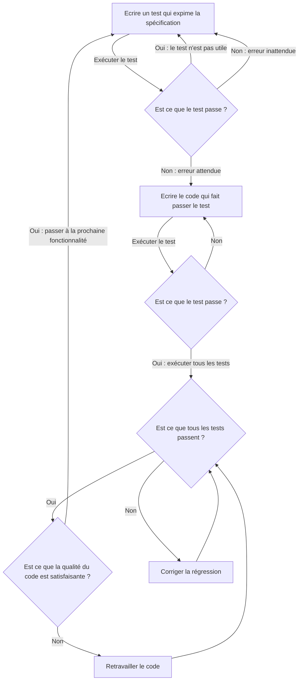

# Cours 2 : Tests Unitaires

## Les tests automatiques

Les tests automatiques ou le code auto-testant ([self-testing code](https://martinfowler.com/bliki/SelfTestingCode.html)) consiste à écrire du code pour vérifier que le code d'une application fonctionne comme prévu.

Ainsi, vous pouvez, en une seule commande ou d'un seul clic, exécuter un ensemble de tests, qui vous dit si votre application contient ou non des bugs majeurs. Cela permet de réduire radicalement le nombre de bugs présent dans le code livré en production.

Mais surtout, on peut développer et ajouter de nouvelles fonctionnalités, ou refactorer du code sans avoir peur d'introduire des régressions majeures dans le code. Il devient donc beaucoup plus facile d'itérer sur du code pour l'enrichir et enn améliorer la qualité. 

Les tests automatiques permettent donc, de manière générale, d'augmenter la qualité et la fiabilité des logiciels pour un investissement en temps raisonnable.

## Les tests unitaires

Les tests unitaires sont les tests automatiques comportant le plus fin niveau de granularité, ils sont très proches des détails d'implémentation. Un test unitaire va tester une *Unité* de code spécifique. Une unité peut être, une méthode, une classe, ou un petit groupe de classe ayant un fort lien logique. 

L'objectif des tests unitaire est donc de vérifier de façon précise le comportement du code dans les différents cas d'usage possible.

Cependant, les tests ne peuvent pas être exhaustifs. Ils aident à trouver les bugs, mais ne permettent
pas d’affirmer qu’il n’y a pas de bugs.

Un test unitaire se découpe en trois étapes : 

- Arrangement : mettre en place les conditions nécessaires à l'exécution du test
- Action : exécuter le code que l'on veut tester
- Affirmation : vérifier que le résultat est bien le bon

En suivant cette logique, les cas de test unitaire s'expriment sous une phrase telle que : 

*Etant donné **\<arrangement\>**, quand **\<action\>**, alors **\<affirmation\>***

Example :

Pour tester une méthode `countWords(String input)`, dont l'objectif est de compter le nombre de mots dans une chaine, un cas de test classique sera : 

***Etant donné** l'input "bonjour le monde" **quand** j'appelle `countWords`, **alors** sa valeur de retour devrait être 3*.

### Écrire des tests unitaires avec `junit-jupiter`

JUnit-Jupiter (ou JUnit 5) est la dernière version du framework de tests JUnit, le framework de tests unitaires de reference pour Java.

#### Classes de test

Avec JUnit, on structure les tests sous forme de suite en utilisant des classes. Chaque classe de test est une suite de tests spécifique à une *Unité*. L'unité étant la plus petite entité de code ayant un sens à être testée, étant donné un contexte. Le plus souvent, c'est une classe, mais cela peut aussi être un petit groupe de classe fortement liées logiquement. Par convention on appelle la classe de test avec le nom de la classe qu'elle teste, suivi de "Tests". 

Par exemple, j'ai une classe `App`, ma classe de test pour cette classe sera `AppTest`. Aussi, la classe de test se trouve dans le même paquet que la classe qu'elle teste, mais du côté de l'arboresence de fichiers sous le dossier `test` de votre projet Java.

Par exemple, voici l'arborescence du dossier source de votre projet Java, avec une classe et sa classe de test, à leur place dans l'arborescence : 

```
└── app
    ├── build.gradle 
    └── src
        ├── main
        │   └── java 
        │       └── demo
        │           └── App.java
        └── test
            └── java 
                └── demo
                    └── AppTest.java
```

#### Méthodes de test

Dans les classes de test, on a des méthodes de test. Chaque méthode correspond à un cas de test. Chaque méthode de test est anotée `@Test`. On peut avoir d'autre méthode utilitaires, qui ne sont pas des cas de test, et ne sont donc pas annotées.

Par exemple, dans la classe `App`, il existe une méthode `countWords` qu'il faut tester. Je peux donc créer le cas de test suivant dans `AppTests` : 

```Java
@Test
void wordCount_givenMultipleWords_thenReturnsRightCount(){

}
```

> En anglais :
> - *Given* signifie "étant donné"
> - *When* signifie "quand"
> - *Then* signifie "alors"

La méthode est nommée selon une convention qui reflète la phrase "EtantDonnée-Quand-Alors", ainsi le cas de test se lit comme une spécification.
Nous pouvons maintenant écrire notre test, en délimitant bien les trois étapes : 

```Java
@Test
void wordCount_whenMultipleWords_returnsRightCount(){
    // Given
    var input = "bonjour le monde";

    // When
    var result = App.countWords(input);

    // Then
    assertEquals(3, result);
}
```

`assertEquals` est une méthode d'assertion (ou vérification), qui permet de faire des vérifications sur le résultat, qui feront échouer le test si jamais la vérification échoue.

Vous pouvez exécuter le test en utilisant le petit bouton "Play" dans la marge de l'éditeur.

### La couverture de test

La couverture de test, est un concept qui permet de voir quel proportion du code de production est exécutée dans le cadre des tests.

Pour exécuter des tests avec la récupération des données de couverture, il faut exécuter les tests avec l'option "Run with coverage", symbolisée par le petit bouclier :


Une fois les tests passés avec ce mode, un outil s'ouvre sur le côté de l'IDE avec un récapitulatif de la proportion de code effectivement exécuté par les tests.


On peut également voir dans l'éditeur quand on ouvre un fichier, une légende dans la marge pour voir ligne par ligne quelles lignes ont été exécutées ou non par la dernière exécution de tests en mode couverture. La légende est verte si la ligne a été exécutée, rouge sinon. Cela peut être utile à regarder pour découvrir quels sont les aspects du code non encore couvert par nos tests, et aider à trouver quels sont les prochains tests à créer pour une couverture optimale.


La couverture de test est un indicateur intéressant de la qualité d'une suite de test, mais elle a ses limites. En effet, si une couverture de code très basse montre que beaucoup de code n'est pas testé, c'est à coup sûr que la suite de tests est insuffisante. Mais, une bonne couverture de tests ne signifie pas nécessairement que la suite de tests est de bonne qualité, car cet indicateur ne donne aucune information sur les vérifications qui sont effectuées par les tests, elles pourraient ne pas être pertinentes, voir complètement manquante. Ainsi, avoir une large couverture du code par les tests est donc une condition nécessaire, mais pas suffisante afin d'avoir une bonne suite de tests.

### Établir des cas de test

Pour établir des cas de test pertinent à postériori de l'écriture du code, il est important de se pencher sur les points "pivots" dans le code qui vont diviser les potentiels flux d'exécution de ce dernier. L'exemple le plus évident de point pivot sont les conditions (`if`,`switch`...) qui vont diviser le flux. Il convient donc de créer des cas de tests pour couvrir chaque côté des flux possible. Quand plusieurs conditions s'enchainent et se combinent, on peut voir les possibilités de flux exploser. On ne peut pas toutes les considérer, il faut alors se poser la question des cas qui ont le plus de sens d'un point de vue fonctionnel, et qui ont un impact sur le résultat global.

### Conception des tests et couplage

Pour avoir des tests de qualité, il faut faire attention de comment on conçoit nos tests, et donc à comment on découpe nos unités.

Le découpage en unité est important, car il permet de la facilité la compréhension en réduisant la largeur du contexte à comprendre à un instant T quand on lit le code. Il faut rassembler dans une unité des éléments qui ont un grand rapport fonctionnel ou technique entre eux.

Créer des tests à un endroit donné, c'est en quelque sorte "sanctuariser une interface (ici interface au sens "interface publique d'une classe" ou contrat de la classe, c'est-à-dire les éléments d'une classe dont du code extérieur peut dépendre), car désormais, les tests dépendent de cette interface, et donc, en cas de modification de l'interface, il faudra aussi modifier tous els tests associés, ce qui peut rendre un changement futur ou un refactoring plus douloureux. Il est normal de "sanctifier" ainsi certaines interfaces, mais il faut éviter d'avoir des tests trop contraignants, trop "serrés" par rapport au code, afin de ne pas rendre les changements futurs plus difficiles.

### Les pseudo-entités

Les pseudo-entités sont des outils permettant de faciliter l'écriture des tests, en replaçant les dépendances de l'unité que l'on teste par des dépendances fausses ou simulées, que l'on peut manipuler facilement dans le contexte du test, afin de reproduire plus facilement des situations à tester, ou pour ignorer des choses qui ne sont pas pertinentes, mais aussi pour accélérer la vitesse d'exécution des tests, en évitant des interactions inutiles dans ce contexte.

Par exemple, pour un système qui va, dans les étapes de son déroulement, envoyer un email, on ne voudrait pas que l'email soit effectivement envoyé pendant l'exécution des tests. On va donc vouloir remplacer la dépendance qui gère l'envoi des mails par une pseudo-entité.

Il existe deux types principaux de pseudo-entités : les faux (*fakes*) et les simulacres (*mocks*).

#### Faux (*Fakes*)

Un faux est une pseudo entité qui va être une vraie implémentation de la dépendance, mais plus simpliste, et avec une encapsulation différente afin de faciliter le test. Un Fake a un comportement cohérent. Exemples : 

- Pour accès à une base de donnée : le faux peut consister à un simple stockage en mémoire

```Java
public interface UsersRepository {
    User findByUsername(String username);
}

public class FakeUsersRepository implements UsersRepository {

    private final Map<String, User> data;
    
    public FakeUsersRepository(Map<String, User> data){
        this.data = data;
    }

    public User findByUsername(String username){
        return this.data.get(username);
    }
}

```

- Pour une dépendance qui fourni le temps présent, et permet de déclencher un événement à un instant T : le faux sera surement une version pour laquelle on peut manipuler le temps

```Java
public record Event(Runnable action,  LocalDateTime executionTime);

public interface Clock {
    LocalDateTime now();
    void enqueueEvent(Event event);
}

public class FakeClock implements Clock {

    private LocalDateTime currentTime;
    private final List<Event> events = new LinkedList<>();

    public FakeClock(LocalDateTime startingTime) {
        currentTime = startingTime;
    }

    public LocalDateTime now() {
        return currentTime;
    }

    public void enqueueEvent(Event event) {
        events.add(event);
    }

    public void advanceTimeBy(Duration duration) {
        currentTime = currentTime.plus(duration);
        executeEvents();
    }

    private void executeEvents() {
        for (var event : events) {
            if (event.executionTime().isBefore(currentTime)) {
                event.action().run();
                events.remove(event);
            }
        }
    }
}
```

#### Simulacres (*mocks*)

Les simulacres sont des pseudo-entités qui ne sont pas des implémentations réelles des dépendances, ce sont simplement des coquilles vides, dont on peut configurer les méthodes pour retourner des valeurs en dur, ou vérifier si elles ont été appelées, combien de fois et comment.

Un cas d'utilisation typique d'un mock est pour un appel à un client HTTP qui requête un système externe. On veut éviter que notre test dépende d'un vrai appel, pour des raisons de rapidité d'exécution du test, de stabilité du test, de coût, et de facilité d'écriture du test. Il est bien plus simple de pouvoir remplacer la réponse de client dans le contexte de notre test pour toujours tester un cas spécifique attendu.

##### Simulacres en Java avec Mockito

Pour installer Mockito, ajouter la dépendance de test à votre projet Gradle : 

```Groovy
testImplementation "org.mockito:mockito-core:3.+"
```
Etant donné une classe qui va compter le nombre d'étoiles github d'une personne avec la logique suivante :

```Java
public class GithubStartsCounter {

    private final GithubApiClient githubApiClient;
    
    public GithubStartsCounter(GithubApiClient githubApiClient){
        this.githubApiClient = githubApiClient;
    }
    
    public int countGithubStars(String username){
        ...
    }
}
```

La dépendance étant la suivante :

```Java
public interface GithubApiClient {
    List<GithubRepo> getUserRepository(String username);
}
```

Nous pouvons mocker la dépendance dans le test :

```Java
public class GithubStartsCounterTests {

    @Test
    public void countGithubStars_whenMultipleRepos_computeRightCount(){
        // Given
        final var testUsername = "johnShepN7";
        final var apiClientMock = mock(GithubApiClient.class);
        
        when(apiClientMock.getUserRepository(testUsername))
            .thenReturn(
                List.of(
                    new GithubRepo("test repo 1", 32),
                    new GithubRepo("test repo 2", 12)
                )
            );
        
        final var counter = GithubStartsCounter(apiClientMock);
        
        // When
        final var result = counter.countGithubStars(testUsername)
        
        // Then
        assertEquals(44, result);
    }
}
```

Dans cet extrait de code :

- Avec la fonction `mock` on peut créer un mock d'un type
- avec les fonctions `when` et `thenReturn`, on peut configurer le mock pour que lorsqu'on appelle la méthode `getUserRepository` avec un paramètre spécifique, alors ce dernier retourne une liste prédéfinie.

On pourrait aussi vouloir configurer la valeur de retour pour n'importe quelle valeur d'argument en utilisant `any()`:

```Java
when(apiClientMock.getUserRepository(any())
    .thenReturn(...);
```

#### Faux, simulacre, ou vraie dépendance ?

Il faut utiliser les vraies dépendances si cela est possible, c'est-à-dire si elles ne font pas d'I/O qui pourrait ralentir ou rendre instable le test. De plus, il faut que la vraie dépendance ne rende pas le test pénible à écrire.

Si les conditions précédentes ne sont pas remplies, alors il convient d'utiliser une pseudo-entité. S'il est possible et que cela facilite les tests d'avoir une implémentation réelle simplifiée, ainsi, l'utilisation d'un fake est à préférer. Cependant, si écrire un fake s'avère trop complexe, que cela ne rend pas le test plus facile à écrire ou à comprendre, alors on se tournera vers l'utilisation d'un mock.

## Écrire du code testable

L'un des concepts de programmation qui est le plus important pour écrire du code testable, c'est l'inversion de dépendance. Cela permet aussi d'obtenir un code plus modulaire, avoir des couplages moins fort, donc plus facile à maintenir et à refactorer.

L'inversion de dépendance consiste à inverser la dépendance entre le code le plus abstrait qui va définir les règles métier de l'application, et le code technique qui fait le lien avec l'infrastructure. On veut que le concret dépende de l'abstrait.

Plus concrètement, cela va se traduire, lors de la conception des classes et des paquets, par l'externalisation sous forme de dépendance de tout le code plus concret qu'une classe donnée. La plupart du temps, on va également voir créer des interfaces pour ces dépendances, afin de minimiser la surface de contact, rendre le contrat de service le plus simple dans le but de réduire au maximum le couplage.

Prenons l'exemple simple d'un programme en ligne de commande, qui demande une suite de nombres à l'utilisateur, puis en fournit la moyenne quand l'utilisateur entre "finished".

```Java
public class AverageCalculator {

    public static void main(String[] args) throws IOException {
        BufferedReader buffer = new BufferedReader(
            new InputStreamReader(System.in)
        );
        
        String input = null;

        List<Integer> numbers = new LinkedList<>();

        while (!Objects.equals(input, "finished")) {
            input = buffer.readLine();
            try {
                numbers.add(Integer.parseInt(input));
            } catch (NumberFormatException ignored) {
            }
        }

        var sum = 0;
        for (var number : numbers) {
            sum += number;
        }

        System.out.print("The average is :" + sum / numbers.size());
    }
}
```

Cette version fonctionne, mais est très difficile à tester, mais aussi pas facile à lire et comprendre, toutes les responsabilités sont mélangée.

Créons donc une classe pour modéliser notre application :

```Java
public class AverageCalculatorApplication {
    public void run(){
        BufferedReader buffer = new BufferedReader(
            new InputStreamReader(System.in)
        );

        List<Integer> numbers = new LinkedList<>();

        while (!Objects.equals(input, "finished")) {
            input = buffer.readLine();
            try {
                numbers.add(Integer.parseInt(input));
            } catch (NumberFormatException ignored) {
            }
        }

        var sum = 0;
        for (var number : numbers) {
            sum += number;
        }

        System.out.printf("The average is : + sum / numbers.size());
    }
}
```

La chose la plus évidente à extraire pour rendre ça plus testable, ce sont les entrées/sorties, avec une interface afin d'avoir un contract minimal et de pouvoir remplacer la dépendance facilement si besoin :

```Java
public interface IO {
    String readLine() throws IOException;
    void print(String text);
}
```

Et ajoutons la dépendance à notre classe :

```Java
public class AverageCalculatorApplication {
    private final IO io;
        
    public AverageCalculatorApplication(IO io) {
        this.io = io;
    }

    public void run() throws IOException {
        String input = null;
        List<Integer> numbers = new LinkedList<>();
        while (!Objects.equals(input, "finished")) {
            input = io.readLine();
            try {
                numbers.add(Integer.parseInt(input));
            } catch (NumberFormatException ignored) {
            }
        }

        var sum = 0;
        for (var number : numbers) {
            sum += number;
        }

        io.print(
            String.format("The average is : " + sum / numbers.size())
        );
    }
}
```

Et l'implémentation des entrées/sorties :

```Java
public class ConsoleIO implements IO {
    private final BufferedReader buffer = new BufferedReader(
        new InputStreamReader(System.in)
    );

    @Override
    public String readLine() throws IOException {
        return buffer.readLine();
    }

    @Override
    public void print(String text) {
        System.out.println(text);
    }
}
```

Ce qui nous donne une méthode "main" ultra simplifiée, qui sert simplement à injecter les dépendances : 

```Java
public class Main {
    public static void main(String[] args) throws IOException {
        final var app = new AverageCalculatorApplication(new ConsoleIO());
        app.run();
    }
}
```

On peut déjà commencer à tester automatiquement en utilisant une fausse dépendances : 

```Java
public class FakeIO implements IO {

    private final Stack<String> givenInput;
    private final List<String> output = new LinkedList<>();

    public List<String> getOutput(){
        return Collections.unmodifiableList(output);
    }

    public FakeIO(List<String> givenInput) {
        this.givenInput = new Stack<String>();
        for (var inputLine : givenInput) {
            this.givenInput.push(inputLine);
        }
    }

    @Override
    public String readLine() throws IOException {
        return givenInput.pop();
    }

    @Override
    public void print(String text) {
        this.output.add(text);
    }
}
```

Cette fausse dépendance d'entrée sortie nous permet de : 

- Donner des lignes qui seront passées comme entrée aux appels de `readLine`
- Enregistrer les sorties de l'application passées à `print`

On peut donc écrire un test automatisé : 

```Java
@Test
public void run_whenMultipleNumbers_printsCorrectOutput() throws IOException {
    // Given
    final var input = List.of("1","3", "finished");

    final var fakeIO = new FakeIO(input);
    final var app = new AverageCalculatorApplication(fakeIO);

    // When
    app.run();

    // Then
    assertEquals(1, fakeIO.getOutput().size());
    var outputLine = fakeIO.getOutput().getFirst();
    assertEquals("The average is : 2\n", outputLine);
}
```

Ensuite, on poursuit la modularisation de l'application, en extrayant la responsabilité du calcul de la moyenne. Cela nous permet de tester ce mécanisme indépendamment :

```Java
public class AverageCalculator {

    public int computeAverage(List<Integer> numbers) {
        var sum = 0;
        for (var number : numbers) {
            sum += number;
        }

        return sum / numbers.size();
    }

}
```

C'est maintenant une dépendance de notre application. Ici pas besoin d'interface, car la cohésion métier entre les deux classes, -l'application qui gère le fait de calculer une moyenne et la classe qui fait effectivement le calcul- est très forte fonctionnellement, et il s'agit d'un calcul qui est très rapide, dans ce contexte ça n'aurait pas d'intérêt ni en termes de modélisation, ni pour les tests de remplacer cette dépendance, on n'a donc pas besoin d'interface :

```Java
public class AverageCalculatorApplication {

    private final IO io;
    private final AverageCalculator averageCalculator;

    public AverageCalculatorApplication(
        IO io, 
        AverageCalculator averageCalculator
    ) {
        this.io = io;
        this.averageCalculator = averageCalculator;
    }

    public void run() throws IOException {
        String input = null;
        List<Integer> numbers = new LinkedList<>();
        while (!Objects.equals(input, "finished")) {
            input = io.readLine();
            try {
                numbers.add(Integer.parseInt(input));
            } catch (NumberFormatException ignored) {
            }
        }

        final var average = averageCalculator.computeAverage(numbers);
        io.print(String.format("The average is :" + average));
    }
}
```

Notre code est maintenant beaucoup plus simple à lire en plus d'être testable !
On doit aussi rajouter l'injection de la dépendance dans la méthode "main" : 

```Java
public class Main {
    public static void main(String[] args) throws IOException {
        final var app = new AverageCalculatorApplication(
            new ConsoleIO(),
            new AverageCalculator()
        );
        app.run();
    }
}
```

Et dans le test de l'application : 

```Java
@Test
public void run_whenMultipleNumbers_printsCorrectOutput() throws IOException {
    // Given
    final var input = List.of("1","3", "finished");

    final var fakeIO = new FakeIO(input);
    final var app = new AverageCalculatorApplication(
        fakeIO, 
        new AverageCalculator()
    );

    // When
    app.run();

    // Then
    assertEquals(1, fakeIO.getOutput().size());
    var outputLine = fakeIO.getOutput().getFirst();
    assertEquals("The average is : 2\n", outputLine);
}
```

On peut donc faire des tests spécifiquement pour le calcul de la moyenne : 

```Java
public class AverageCalculatorTests {

    @Test
    public void computeAverage_nominalCase_returnsCorrectResult(){
        // Given
        final var numbers = List.of(0, 20);
        final var calculator = new AverageCalculator();

        // When
        final var result = calculator.computeAverage(numbers);

        // Then
        assertEquals(10, result);
    }

    @Test
    public void computeAverage_oneNumber_returnsCorrectResult(){
        // Given
        final var numbers = List.of(20);
        final var calculator = new AverageCalculator();

        // When
        final var result = calculator.computeAverage(numbers);

        // Then
        assertEquals(20, result);
    }
}
```

## Le développement dirigé par les tests

### Qu'est-ce que le développement dirigé par les tests (Test Driven Development - TDD)

Le TDD est une méthode de conception et de développement dite "test-first" (les tests en premier). Au lieu d'écrire le code, puis, après d'en écrire les tests, on va entrelacer le fait d'écrire des tests et le code de production. On avance par petits pas au cours desquels on écrit d'abord un test, puis le code de production qui suffit à faire passer le test.

On peut résumer cela sous la forme d'un cycle à trois étapes RED-GREEN-REFACTOR : 

- <format color="red">RED</format> : écrire un test qui ne passe pas (ne pas compiler compte comme ne pas passer)
- <format color="green">GREEN</format> : écrire le code de production minimal qui suffit à faire passer le test
- <format color="Blue">REFACTOR</format> : retravailler le code écrit pour en améliorer la conception et la propreté


Les objectifs du TDD sont : 

- Du code propre, qui marche, écrit en un temps prédictible
- Une spécification exécutable : les tests sont vraiment exhaustif et font des vérifications pertinentes

Le processus de développement est le suivant : 



Les avantages du TDD : 

- **Vitesse** : permet de valider plus vite les idées, passer moins de temps à débugger et à tester manuellement. Les bugs sont aussi attrapés plus vite.
- **Confiance** : Les tests sont plus fiables et pertinents, ils sont une vraie spécification exécutable. Aussi, on a une bonne sécurité contre la régression lorsqu'on change le code.
- **Qualité** : force la réflexion autour des interfaces, on détecte ainsi les problèmes de conception plus tôt. On est forcé à refactorer plus souvent, donc on produit du meilleur code

Le TDD permet aussi de faciliter le processus de résolution de problème. Résoudre des problèmes, c'est gérer la complexity, et déconstruire les problèmes en plus petits. Le TDD est itératif et incrémental, la stratégie "diviser pour mieux régner", est incluse dans le processus. Cela permet de réduire la charge cognitive à un instant T quand on développe.

Attention cependant, le TDD n'est pas une méthode magique. L'adopter requiert un effort pour en adopter l'état d'esprit. C'est une compétence qui requiert du temps et de la pratique pour être maîtrisée, ce qui fait que l'on est plus lent au début. 

Références du cours : 

- [La documentation de JUnit](https://junit.org/junit5/docs/current/user-guide/)
- [La documentation de Mockito](https://javadoc.io/doc/org.mockito/mockito-core/latest/org/mockito/Mockito.html#1)
- [Le Bliki de Martin Fowler](https://martinfowler.com/bliki/)
- [*TDD by example* de Kent Beck](https://books.google.fr/books/about/Test_Driven_Development.html?id=zNnPEAAAQBAJ)