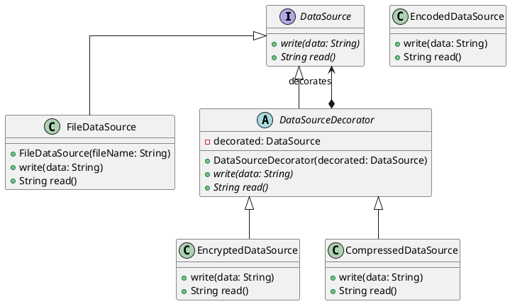
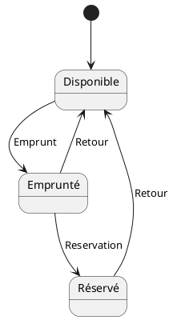
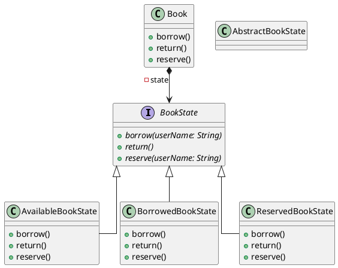
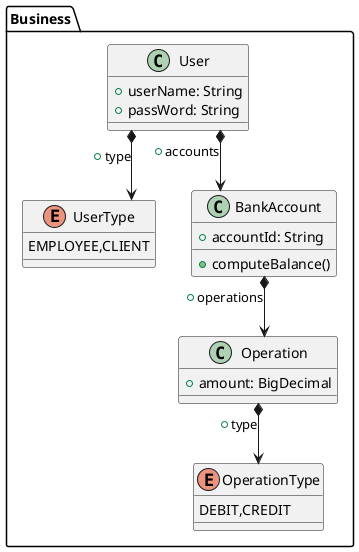
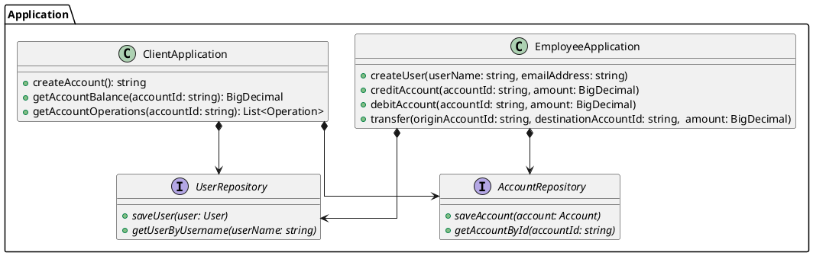

# Cours 3 : Qualité Logicielle

Pour produire des logiciels de bonne qualité, du code qui se maintient sur la durée, il y a des techniques qui peuvent aider, et des concepts à maîtriser afin d'avoir des réflexions autour de la qualité du code.

## Concepts

### Polymorphisme

Le polymorphisme est l'épine dorsale de la programmation orientée objet. Cela consiste à utiliser les contrats de service pour manipuler de façon transparente des classes différentes qui implémentent ces contrats de service. Autrement dit, cela permet à du code de manipuler facilement des concepts en ignorant totalement les détails de l'implémentation. Le code utilisateur dépend du contrat de service, plutôt que du code qui l'implémente.

C'est fondamentalement, car énormément de mécanisme qui permettent de mieux structurer le code, en le rendant plus facile à lire et à maintenir reposent sur le polymorphisme.

Un exemple simple de polymorphismes est l'interface `List<T>` en Java, qui peut contenir une référence à une `ArrayList` ou à une `LinkedList` indistinctement, pourtant ce dont des implémentations de liste qui différent complétement. Cependant, grâce au polymorphisme apporté par l'utilisation de l'interface `List<T>`, du code utilisant une liste d'ignorer complétement sur quelle implémentation cette dernière repose.

```Java
public int computeAverage(List<Integer> numbers) {
    var sum = 0;
    for (var number : numbers) {
        sum += number;
    }

    return sum / numbers.size();
}
```

Ici `numbers` pourrait contenir aussi bien une `ArrayList` qu'une `LinkedList`, cela ne change rien pour notre méthode. Cela permet beaucoup de chose : 

- Quand on lit le code, on n'a même pas à se poser la question de l'implémentation de la liste, juste de savoir ce qu'une `List<T>` **peut** faire et non **comment** elle le fait. Cela rend le code plus simple à lire, car il contient moins d'information, et ce n'est pas grave, cette information n'est pas du tout utile au fonctionnement de la méthode.
- Si on rajoute un nouveau type de liste, qui implémente le contrat de service établi par l'interface `List<T>` avec une implémentation différente encore, on pourrait l'utiliser comme paramètre de cette méthode, sans la modifier.

### Inversion et injection de dépendances

L'inversion de dépendances est une technique de modularisation du code reposant sur le polymorphisme. Elle a déjà été évoquée dans la partie du cours sur les tests, mais elle est utile au délà du fait de produire du code testable. Elle aide beaucoup à diviser les problèmes en petites parties ayant chacune leurs responsabilités, et ayant entre elle un niveau de couplage adapté à leur cohésion fonctionnelle.

L'injection de dépendance consiste à fournir à une classe ses dépendances comme paramètres du constructeur. Elle permet une inversion de dépendance efficace : la classe ne se préoccupe pas de comment sont construites ses dépendances, car ce n'est pas sa responsabilité, c'est le code utilisateur de la classe qui doit s'en charger.

## Patrons de conception (Design Patterns)

Un patron de conception est une "recette" qui apporte une solution préfabriquée à un problème connu et récurant en ingénierie logicielle. Il en existe beaucoup, l'un des ouvrages de référence en la matière est [Design Patterns:Elements of Reusable Object-Oriented Software](https://en.wikipedia.org/wiki/Design_Patterns). Je vais présenter ceux qui sont (à mon sens et selon mon expérience) les plus intéressants à connaître.

### Pattern Décorateur (Decorator)

Le pattern décorateur permet de combiner des composants de façon transparente en utilisant la délégation. Les composants s'emboitent en s'enveloppant comme des poupées russes, sans que le code appelant n'en ai connaissance.

Il est utile quand on a besoin de pouvoir rajouter des comportements à un composant de façon dynamique sans casser le code appelant.

La structure du pattern est la suivante : 

- Une interface : l'interface qui établit le contrat de service avec le code appelant.
- Le composant concret : l'implémentation "de base" de l'interface qui a le comportement par défaut.
- Le décorateur abstrait : une classe abstraite qui implémente l'interface et factorise le fait de déléguer le comportement par défaut à une instance de l'interface.
- Les décorateurs concrets : des classes implémentant le décorateur abstrait et enveloppant le comportement de l'instance qu'elle décore avec un nouveau comportement.

On peut prendre l'exemple d'un composant de source de donnée qui écrit et lit des données dans un système de stockage, avec la possibilité de chiffrer, encoder, ou de compresser les données.

La structure serait la suivante :



En implémentant ce pattern, on pourra avoir du code client comme ceci : 

```Java
DataSource regularDataSource = new FileDateSource("myFile.txt")

DataSource encryptedDataSource = new EncryptedDataSource(
    FileDateSource("encryptedFile.txt")
);

DataSource compressedDataSource = new CompressedDataSource(
    FileDateSource("compressed.txt")
);

DataSource = encryptedAndCompressedDatasource = new EncryptedDataSource(
    new CompressedDataSource(
        FileDateSource("compressed.txt")
    )
); 
```

On peut donc combiner de façon transparente ces comportements simples, isolés ou combinés, derrière la simple interface `DataSource`.

### Pattern Fabrique (Factory)

Une fabrique est une classe à qui on va déléguer la création d'un objet. Cela peut être utile principalement dans deux situations différentes. 

#### Création d'objet complexe

La création d'un objet devient trop complexe pour incomber à l'objet lui-même

#### Découplage de création d'objet

Situation : on a une interface des classes qui l'implémentent pour régler un problème par polymorphisme, et on veut déléguer la responsabilité de création.

Par exemple, nous avons cette classe qui évalue des expressions mathématiques, et qui a donc besoin de résoudre des opérations avec sa méthode `executeComputation` : 

```Java
public class ReversePolishNotationCalculator {

    ...
    
    private void executeComputation(String token, Stack<Double> computeStack) {
        ...
        
        final var result = switch (token) {
            case "*" -> computeStack.pop() * computeStack.pop();
            case "/" -> computeStack.pop() / computeStack.pop();
            case "+" -> computeStack.pop() + computeStack.pop();
            case "-" -> computeStack.pop() - computeStack.pop();
            default -> throw new IllegalArgumentException();
        };

        ...
    }
    
    ...

}
```

On voudrait la refactorer en utilisant le polymorphisme pour sortir cette responsabilité, et donc pouvoir modifier et ajouter des opérateurs sans modifier cette classe. Je crée une interface pour cela, avec les classes qui vont avec : 

```Java
public interface Operator {
    Double execute(Stack<Double> computeStack):
}

public class MultiplyOperator implement Operator {
    Double execute(Stack<Double> computeStack) {
         ... 
    }
}

public class DivideOperator implement Operator {
    Double execute(Stack<Double> computeStack) {
         ... 
    }
}

public class PlusOperator implement Operator {
    Double execute(Stack<Double> computeStack) {
         ... 
    }
}

public class MinusOperator implement Operator {
    Double execute(Stack<Double> computeStack) {
         ... 
    }
}
```

Maintenant, la fabrique va nous aider à abstraire la création des opérations de notre classe `ReversePolishNotationCalculator` : 

```Java
public class OperatorFactory {
    public Operator buildOperator(String token) {
       return switch (token) {
            case "*" -> new MultiplyOperator();
            case "/" -> new DivideOperator();
            case "+" -> new PlusOperator();
            case "-" -> new MinusOperator();
            default -> throw new IllegalArgumentException();
        };
    }
}
```

Et on peut donc l'utiliser dans notre classe comme dépendance :

```Java
public class ReversePolishNotationCalculator {

    public final OperatorFactory operatorFactory;

    public ReversePolishNotationCalculator(OperatorFactory operatorFactory){
        this.operatorFactory = operatorFactory;
    }

    ...
    
    private void executeComputation(String token, Stack<Double> computeStack) {
        ...
        
        final var operator = operatorFactory.buildOperator(token);
        final var result = operator.execute(computeStack);

        ...
    }
    
    ...

}
```

Ainsi, grâce à notre factory, la résolution des opérations est abstraite de la `ReversePolishNotationCalculator`, on peut ajouter et modifier des opérateurs sans avoir à modifier la classe, on a distribué la responsabilité.


### Pattern Etat (State)

Le pattern Etat permet de modéliser de façon efficace une situation où un élément peut posséder différents états qui changent son comportement. Il repose sur la délégation et le polymorphisme pour éviter d'avoir une arborescence illisible de `if`.

Prenons l'exemple suivant : des livres dans une bibliothèque. Un livre dans une bibliothèque peut être **disponibles**, c'est-à-dire sur les étagères de la bibliothèque, prêt à être emprunté. Ensuite si on l'emprunte, il devient **emprunté**, tant qu'il est emprunté, il ne peut pas être **emprunté** par quelqu'un d'autre, mais il peut être **réservé**, ce qui va notifier la personne qui le réserve lorsqu'il est retourné. Quand il est retourné, il redevient disponible.

Cela nous donne le diagramme d'état transition suivant : 



La logique du pattern consiste donc à déléguer les actions relatives à l'état à des classes représentant chaque état : 



Voici un exemple en Java : 

```Java
public interface BookState {
    void borrow(String userName);
    void reserve(String userName);
    void giveBack();
}

public class Book {
    private BookState state;

    public Book() {
        state = new AvailableBookState(this);
    }

    public void setState(BookState state) {
        this.state = state;
    }

    public void borrow(String userName) {
        state.borrow(userName);
    }

    public void reserve(String userName) {
        state.reserve(userName);
    }

    public void giveBack() {
        state.giveBack();
    }
}

public class AvailableBookState implements BookState {

    private final Book book;

    public AvailableBookState(Book book) {
        this.book = book;
    }

    @Override
    public void borrow(String userName) {
        book.setState(new BorrowedBookState(book, userName));
    }

    @Override
    public void reserve(String userName) {
        throw new IllegalStateException("Can't reserve an available book");
    }

    @Override
    public void giveBack() {
        throw new IllegalStateException("Can't giveBack an available book");
    }
}


public class BorrowedBookState implements BookState {
    private final Book book;
    private final String borrowerUserName;

    public BorrowedBookState(Book book, String borrowerUserName) {
        this.book = book;
        this.borrowerUserName = borrowerUserName;
    }

    @Override
    public void borrow(String userName) {
        throw new IllegalStateException("Can't borrow an already borrowed book");
    }

    @Override
    public void reserve(String userName) {
        book.setState(new ReservedBookState(book, userName));
    }

    @Override
    public void giveBack() {
        book.setState(new AvailableBookState(book));
    }
}

public class ReservedBookState implements BookState {
    private final Book book;
    private final String reserverUserName;
    

    public ReservedBookState(Book book, String reserverUserName) {
        this.book = book;
        this.reserverUserName = reserverUserName;
    }

    @Override
    public void borrow(String userName) {
        throw new IllegalStateException("Can't borrow an already borrowed book");
    }

    @Override
    public void reserve(String userName) {
        throw new IllegalStateException("Can't reserve an already reserved book");
    }

    @Override
    public void giveBack() {
        book.setState(new AvailableBookState(book));
        notifyAvailability(reserverUserName);
    }
}
```

Ainsi, on a un code qui reflète bien les contraintes des règles métier du livre. Cela permet aussi un design plus maintenable et extensible, on peut facilement rajouter un état, modifier le comportement des états, sans impacter la classe livre.

## Qualité d'écriture du code

Quand on écrit du code, on l'écrit pour la machine, pour qu'elle fasse ce qu'on veut qu'elle fasse, mais pas seulement. On écrit aussi notre code pour qu'il soit lu par d'autres humains ; nous, nos collègues, co-contributeurs open-source...

Ainsi, pour écrire du code de qualité, il faut que le code communique les intentions de l'auteur, afin qu'il soit lisible et compréhensible par quelqu'un au fur et à mesure de la lecture. Il faut que le code se lise presque comme un texte.

### Nommer les éléments pour révéler l'intention

Pour révéler son intention, il faut utiliser des noms précis et complets quand on nomme les symboles de notre code : classes, méthodes, champs, variables... 

Cela veut dire, pour les noms : 

- Ne pas faire d'abréviations
- Ne pas utiliser d'acronymes
- Toujours décrire l'objectif du symbole dans son nom
- Ne pas avoir peur d'avoir des noms de symboles longs
- Utiliser des noms anglais
- Utiliser des noms prononçables
- Ne pas utiliser de nombres magiques

Spécifiquement les noms de :

- *Classes* doivent être des noms ou des phrases nominales : `Customer`, `WikiPage`, `Customer`, `AddressParser`
- *Méthodes* doivent être des verbes ou des phrases verbales : `postPayment`, `deletePage`, `save`

Exemple : 

```Java
public List<int[]> getThem(){
    List<int[]> list1 = new ArrayList<int[]>();
    for(int[] x : theList){
        if(x[0] == 4){
            list1.add(x);
        }
    }
    return list1;
}
```

Cette méthode ne fait rien de très compliqué, elle n'est pas trop longue, son indentation est correcte, mais elle est très difficile à lire, car les noms des symboles ne donnent aucune information.

On peut améliorer cela : 

```Java
public List<int[]> getFlaggedCells(){
    List<int[]> flaggedCells = = new ArrayList<int[]>();
    for(int[] cell : gameboard){
        if(cell[STATUS_VALUE] == FLAGGED){
            flaggedCells.add(cell);
        }
    }
    return flaggedCells;
}
```

Juste en changeant des noms et des nombres magiques, on obtient une méthode qui communique de l'information, si bien que même sans avoir trop de contexte, on comprend tout de suite de quoi il retourne.

### Utilisations des méthodes/fonctions pour révéler l'intention

Les méthodes/fonctions doivent être le plus courtes possible. Il est tout à fait normal de faire des fonctions/méthodes qui ne sont appelées qu'à un seul endroit, donc pour autre chose que pour mutualiser du code, simplement parce qu'en extrayant et remplaçant une fonction/méthode d'un bloc de code, on donne un nom au bloc en question, donc on révèle l'intention qu'il y a dérrière, mais aussi, on cache les détails qui ne sont pas nécessairement importants à la compréhension.

Une méthode/fonctions ne devrait pas faire plus de 20 lignes, elle en fait idéalement moins de 10.

Lorsqu'on implémente un algorithme, une logique, c'est normal de tout écrire d'une traite, c'est plus facile pour écrire, mais ensuite, il faut refactorer pour faciliter la lecture, en repérant les blocs de code qui ont du sens et les extraire sous forme de méthode/fonction. La fonctionnalité de l'IDE "Refactorer : extraire en tant que méthode" est très utile pour faire cela rapidement.

Par exemple, la méthode suivante évalue une expression mathématique : 

```Java
public double compute(String polishNotationExpression) {
    var computeStack = new Stack<Double>();

    String[] tokens = polishNotationExpression.split(" ");

    for (var token : tokens) {
        if (!OPERATORS.contains(token)) {
            try {
                computeStack.push(Double.parseDouble(token));
            } catch (NumberFormatException ignored) {
                throw new IllegalArgumentException();
            }
        } else {
            if (!OPERATORS.contains(token)) {
                throw new IllegalArgumentException();
            }

            computeStack.push(switch (token) {
                case "*" -> computeStack.pop() * computeStack.pop();
                case "/" -> computeStack.pop() / computeStack.pop();
                case "+" -> computeStack.pop() + computeStack.pop();
                case "-" -> computeStack.pop() - computeStack.pop();
                default -> throw new IllegalArgumentException();
            });
        }
    }

    if (computeStack.size() > 1) {
        throw new IllegalArgumentException();
    }

    return computeStack.pop();
}
```

La méthode `compute()` est trop longue et pourrait être divisée pour une meilleure lisibilité, simplement par l'extraction de blocs en tant que méthodes privées de la classe : 

```Java
    public double compute(String polishNotationExpression) {
        var computeStack = new Stack<Double>();
        String[] tokens = polishNotationExpression.split(" ");

        for (var token : tokens) {
            if (!isOperator(token)) {
                addOperandOnStack(token, computeStack);
            } else {
                executeOperation(token, computeStack);
            }
        }

        ensureExpressionIsValid(computeStack);
        return computeStack.pop();
    }
```

La logique de l'algorithme apparait de façon beaucoup plus évidente, et le code de la méthode se lit comme un texte qui décrit cet algorithme : 

*For each token, if not is operator, then add as an operand on the stack, else execute an operation*.

Les règles à retenir : 

- Méthodes/fonctions courtes : pas plus de 20 lignes, 10 lignes idéalement
- Chaque méthode/fonction doit faire une seule chose
- Séparer les Commandes et les Requêtes, une méthode/fonction est soit l'un, soit l'autre, par les deux :
  - Requête : calculer une valeur
  - Commande : Faire une action
- Utiliser les méthodes/fonctions et leur nom pour décrire des blocs logiques
- Pas plus de 4 arguments pour méthode/fonction

## Qualité d'architecture du code

### Architecture en couche

Pour structurer une application avec une architecture modulaire pour faciliter le développement et la maintenance, l'architecture en couche est très utile : 

- La couche métier : les objets qui représentent les situations et règles métier
- La couche application : implémente les cas d'utilisation de l'application en utilisant les objets de la couche métier
- La couche d'interface : lien entre l'application et le monde extérieur (interface graphique, API Web...)
- La couche infrastructure : les outils techniques qui soutiennent les autres couches (frameworks)


L'idée est que la dépendance entre ces couches doit être de la plus concrète vers la plus abstraite : la couche interface dépend de la couche application, qui elle, dépend de la couche métier, la plus abstraite.

#### Couche métier

Pour structurer le code de la couche métier, certains concepts sont intéressants :

- Entité : objet métier qui a une identité unique
- Objet-valeur : objet métier qui n'a pas d'identité unique
- Association : lien entre des objets métier
- Service : les processus qui ne sont pas de la responsabilité des objets
- Modules / paquets : segmentation logique des unités de code

#### Couche application

La couche application implémente les cas d'utilisation de l'application, les points d'entrée métier de l'application. On peut la structurer en classes qui vont chacune regrouper une catégorie de cas d'utilisation. Elle implémente ces cas d'utilisation avec les objets de la couche métier, et définit des contrats de services dont la couche interface va dépendre.

#### Couche interface

La couche interface fait le lien entre la couche application et la couche infrastructure, c'est le code qui va par exemple implémenter la logique de présentation d'une interface graphique, ou le contrôleur d'une API Web, mais aussi par exemple implémenter la persistence de données.

#### Couche infrastructure

La couche infrastructure est la plupart du temps constitué de code qu'on ne va pas écrire dans le cadre de l'application, mais plutôt reposer sur des frameworks, libraries, et systèmes externes. On va y retrouver par exemple, le framework web, la libraire d'interface graphique, le driver de base de donnée.

### Exemple

Faisons un exemple d'analyse d'architecture pour l'application ayant les spécifications suivantes : 

Un système de gestion de compte en banque qui a deux types d'utilisateur : les clients de la banque et les employés de la banque.

Le client peut :

- Ouvrir un compte en banque
- Consulter le solde d'un compte en banque
- Consulter la liste des opérations du compte en banque

L'employé peut :

- Créer un compte utilisateur
- Créditer un compte suite à un dépôt de liquide
- Débiter un compte suite à un retrait de liquide
- Effectuer un virement d'un compte à un autre

L'application doit être une API web qui sera consommée par des applications clientes sur le poste de l'employée et sur le smartphone du client.

En faisant l'analyse de cette spécification, on peut concevoir dans un premier temps l'architecture suivante.

#### Analyse couche métier




On a : 

- Entités : `User` et `BankAccount`
- Objet valeur : `Operation`
- Associations : Un `User` peut avoir plusieurs `BankAccount`. Un `BankAccount` peut avoir plusieurs `Operation`

#### Analyse couche application



On fait une classe par catégorie de cas utilisation, et on établit deux types de contrat de service : 

- Les méthodes publiques de nos classes correspondent chacune à un cas d'utilisation, et seront appelées par la couche interface.
- Les interfaces pour la persistance des données, ces interfaces seront implémentées par des classes de la couche interface

#### Analyse couche interface

On aura ici deux types d'éléments : 

- Des contrôleurs web qui vont exposer les méthodes de la couche application via une API web, et s'occupent de la sérialisation, de l'authentification des utilisateurs, des endpoints...
- Des repositories, des classes qui vont implémenter les interfaces de repository de la couche application pour sauvegarder les données de l'application dans un système de base de donnée en faisant des requêtes SQL

#### Analyse couche infrastucture

Ici, on va retrouver les éléments ce sur quoi reposent les couches d'au-dessus : 

- Le framework web pour l'API
- Le serveur de base de donnée et la bibliothèque d'accès base de donnée

Et un peu de code pour configurer ces composants.

## Références du cours

- [Refactoring.guru : Decorator Pattern](https://refactoring.guru/design-patterns/decorator)
- [*Refactoring : Improving the Design of Existing Code* de Martin Fowler](https://books.google.fr/books/about/Refactoring.html?id=HmrDHwgkbPsC&source=kp_book_description&redir_esc=y)
- [Le Bliki de Martin Fowler](https://martinfowler.com/bliki/)
- [*Clean Code* de Robert C. Martin](https://books.google.fr/books/about/Clean_Code.html?id=hjEFCAAAQBAJ&source=kp_book_description&redir_esc=y)
- [*Clean Architecture: A Craftsman's Guide to Software Structure and Design* de Robert C. Martin](https://books.google.fr/books/about/Clean_Architecture.html?id=uGE1DwAAQBAJ&source=kp_book_description&redir_esc=y)
- [*Domain Driven Design* de Eric Evans](https://books.google.fr/books/about/Domain_Driven_Design.html?id=hHBf4YxMnWMC&source=kp_book_description&redir_esc=y)