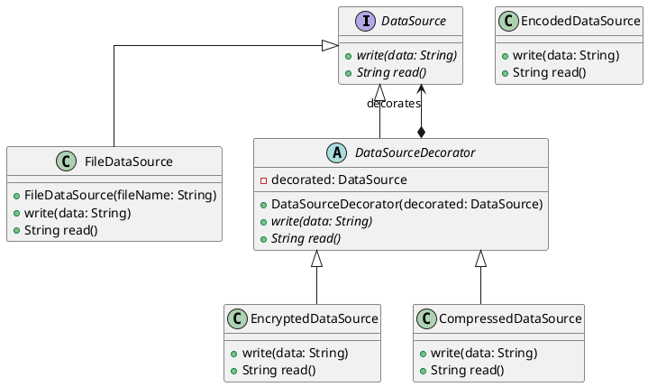

# Cours 3 : Qualité Logicielle

Pour produire des logiciels de bonnee qualités, du code qui se maintient sur la durée, il y a des techniques qui peuvent aider, et des concepts à maîtriser afin d'avoir des réflexions autour de la qualité du code.

## Concepts

### Polymorphisme

Le polymorphisme est l'épine dorsale de la programmation orientée objet. Il consiste à utiliser les contrats de service pour manipuler de façon transparente des classes différentes qui implémentent ces contrats de service. Autrement dit, cela permet à du code de manipuler facilement des concepts en ignorant totalement les détails de l'implémentation. Le code utilisateur dépend du contrat de service, plutôt que du code qui l'implémente.

C'est fondamentalement, car énormément de mécanisme qui permettent de mieux structurer le code, en le rendant plus facile à lire et à maintenir reposent sur le polymorphisme.

Un exemple simple de polymorphismes est l'interface `List<T>` en Java, qui peut contenir une référence à une `ArrayList` ou à une `LinkedList` indistinctement, pourtant ce dont des implémentations de liste qui différent complétement. Cependant, grâce au polymorphisme apporté par l'utilisation de l'interface `List<T>`, du code utilisant une liste d'ignorer complétement sur quelle implémentation cette dernière repose.

```Java
public int computeAverage(List<Integer> numbers) {
    var sum = 0;
    for (var number : numbers) {
        sum += number;
    }

    return sum / numbers.size();
}
```

Ici `numbers` pourrait contenir aussi bien une `ArrayList` qu'une `LinkedList`, cela ne change rien pour notre méthode. Cela permet beaucoup de chose : 

- Quand on lit le code, on n'a même pas à se poser la question de l'implémentation de la liste, juste de savoir ce qu'une `List<T>` **peut** faire et non **comment** elle le fait. Cela rend le code plus simple à lire, car il contient moins d'information, et ce n'est pas grave, cette information n'est pas du tout utile au fonctionnement de la méthode.
- Si on rajoute un nouveau type de liste, qui implémente le contrat de service établi par l'interface `List<T>` avec une implémentation différente encore, on pourrait l'utiliser comme paramètre de cette méthode, sans la modifier.

### Inversion et injection de dépendances

L'inversion de dépendances est une technique de modularisation du code reposant sur le polymorphisme. Elle a déjà été évoquée dans la partie du cours sur les tests, mais elle est utile au délà du fait de produire du code testable. Elle aide beaucoup à diviser les problèmes en petites parties ayant chacune leurs responsabilités, et ayant entre elle un niveau de couplage adapté à leur cohésion fonctionnelle.

L'injection de dépendance consiste à fournir à une classe ses dépendances comme paramètres du constructeur. Elle permet une inversion de dépendance efficace : la classe ne se préoccupe pas de comment sont construites ses dépendances, car ce n'est pas sa responsabilité, c'est le code utilisateur de la classe qui doit s'en charger.

## Patrons de conception (Design Patterns)

Un patron de conception est une "recette" qui apporte une solution préfabriquée à un problème connu et récurant en ingénierie logicielle. Il en existe beaucoup, l'un des ouvrages de référence en la matière est [Design Patterns:Elements of Reusable Object-Oriented Software](https://en.wikipedia.org/wiki/Design_Patterns). Je vais présenter ceux qui sont (à mon sens et selon mon expérience) les plus intéressants à connaître.

### Pattern Décorateur (Decorator)

Le pattern décorateur permet de combiner des composants de façon transparente en utilisant la délégation. Les composants s'emboitent en s'enveloppant comme des poupées russes, sans que le code appelant n'en ai connaissance.

Il est utile quand on a besoin de pouvoir rajouter des comportements à un composant de façon dynamique sans casser le code appelant.

La structure du pattern est la suivante : 

- Une interface : l'interface qui établit le contrat de service avec le code appelant.
- Le composant concret : l'implémentation "de base" de l'interface qui a le comportent par défaut.
- Le décorateur abstrait : une classe abstraite qui implémente l'interface et factorise le fait de déléguer le comportement par défaut à une instance de l'interface.
- Les décorateurs concrets : des classes implémentant le décorateur abstrait et enveloppant le comportement de l'instant qu'elle décore avec un nouveau comportement.

On peut prendre l'exemple d'un composant de source de donnée qui écrit et lit des données dans un système de stockage, avec la possibilité de chiffrer, encoder, ou de compresser les données.

La structure serait la suivante :



En implémentant ce pattern, on pourra avoir du code client comme ceci : 

```Java
DataSource regularDataSource = new FileDateSource("myFile.txt")

DataSource encryptedDataSource = new EncryptedDataSource(
    FileDateSource("encryptedFile.txt")
);

DataSource compressedDataSource = new CompressedDataSource(
    FileDateSource("compressed.txt")
);

DataSource = encryptedAndCompressedDatasource = new EncryptedDataSource(
    new CompressedDataSource(
        FileDateSource("compressed.txt")
    )
); 
```

On peut donc combined de façon transparente ces comportements simples, isolés ou combinés, derrière la simple interface `DataSource`.

### Pattern Fabrique (Factory)

### Pattern Etat (State)

## Coder proprement (*Clean Code*)

### Découper les méthodes pour révéler l'intention

niveau d'abstraction

### Nommer les éléments pour révéler l'intention

## Architecture propre

## Développement dirigé par le domaine

## Références du cours

- [Refactoring.guru : Decorator Pattern](https://refactoring.guru/design-patterns/decorator)
- 