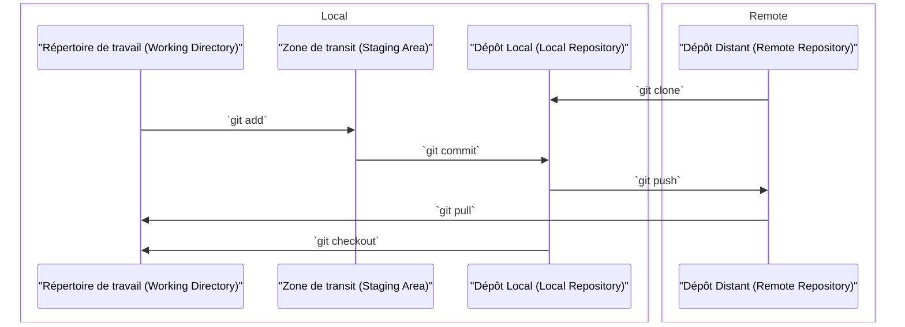

# Git

## Qu'est-ce que Git ?

Git est un **système de gestion de version** (version control system ou VCS en anglais). Il en existe d'autre (Mercurial, SVN), mais git est de loin le plus utilisé de nos jours.

L'objectif du système de gestion de version est de versionner efficacement notre code, suivre précisément les changements qu'on y apporte, et naviguer facilement à travers les différentes versions. Cela est très important, car cela permet de ne jamais perdre de changement, ou de pouvoir revenir en arrière en cas soucis par exemple.

Git facilite également la coopération à plusieurs sur un projet. Il permet de travailler en parallèle et de réconcilier les versions qui ont divergé.

## Concept importants

### Commit

Un commit est une sauvegarde de l'intégralité d'une version du projet à un instant T. Il représente une étape dans l'historique.

### Branche

Permet de faire diverger en parallèle plusieurs versions du projet pour pouvoir les réconcilier facilement plus tard.

## Installer git

<tabs>
<tab title="Windows (winget)">

```bash
winget install -e --id Git.Git
```

</tab>
<tab title="Debian/Ubuntu (APT)">

```Bash
apt-get install git
```

</tab>
<tab title="MacOS (Homebrew)">

```Bash
brew install git
```

</tab>
</tabs>


Configuration du compte local :

```bash
git config --global user.name "Your Name"
git config --global user.email "youremail@yourdomain.com"
```

## Créer un dépot local

```bash
mkdir dossierPourMonDepot
cd dossierPourMonDepot
git init
```

## Workflow Git "de base"

### Créer un commit

1. `git add .` : ajouter tous les changements au tracking git
2. `git commit -m "Message de commit"` : créer un commit avec les changements

### Créer une branche

1. `git branch nomDeLaBranche` : créer la branche
2. `git checkout nomDeLaBranche` : se positionner sur la branche

## Fusion

Pour rapport les changements d'une branche sur une autre, on fusionne :

Pour fusionner (*merge*) la branche b2 dans la branche b1

```bash
git checkout brancheCible
git merge brancheAFusionner
```

Il peut y avoir des conflits à résoudre si les mêmes lignes ont été changées dans les historiques divergents.

## Conflits de fusion

Lorsque les deux branches que vous voulez fusionner contiennent des modifications différentes des mêmes lignes, un conflit de fusion apparaît, il faut donc le régler.

Après avoir fait votre commande de fusion qui avait des conflits, git se met en mode résolution de conflit, et va faire apparaitre dans les fichiers contenant des conflits les deux versions des lignes qui sont en conflits sous le format suivant :

```
<<<<<<< HEAD
contenu de la ligne selon la branche courante (celle dans laquelle on fusionne)
=======
contenu de la ligne selon la branche que l'on est en train de fusionner
>>>>>>> nom-de-ma-branche-fusionnee
```

Il faut donc soit garder une des deux versions et supprimer totalement l'autre, ou alors faire un nouveau changement à partir des deux versions, ce qui a du sens dans le contexte du code sur cette ligne. Les marqueurs de conflits (`<<<<<<<`, `=======`, `>>>>>>>`) doivent être supprimés pour que git considère le conflit résolu.

Une fois tous les conflits résolus, on peut commiter les changements (`git add .` et `git commit -m "conflict resolved"`) afin de marquer la résolution du conflit.

> La plupart des outils graphiques Git permettent de résoudre plus facilement les conflits de fusion, en présentant une interface qui permet de comparer les différentes versions côte à côte, et d'en adopter l'une ou l'autre d'un clic. C'est le cas de l'outil Git intégré à IntelliJ.

## Serveurs

On utilise un dépot distant pour se synchroniser avec les gens avec qui on coopère. Il y a principalement :

- Github
- Gitlab

## Ajouter un dépot distant

```bash
git remote add nomLocalDuDepotDistant urlDuDepotDistant
```

## Intéractions avec un dépot distant

Pousser des changements :

```bash
git push nomDeLaBranche
```

Tirer des changements :

```bash
git pull nomDeLaBranche
```

Mettre à jour les infos sur le dépot distant :

```
git fetch
```

## Récapitulatif des espaces git et de leurs intéractions



## Récapitulatif du workflow de base pour implémenter une fonctionnalité

1. Se positionner sur la branche principale : `git checkout master`
2. Mettre à jour la branche principale : `git pull origin master` (origin étant le nom standard pour un dépôt distant, mais ce nom est personnalisable)
3. Créer une nouvelle branche à partir de la branche principale : `git branch maFeature`
4. Se positionner sur la nouvelle branche : `git checkout maFeature`
5. Faire des changements dans le code
6. Ajouter les changements à git : `git add .`
7. Créer un nouveau commit avec les changements : `git commit -a -m "message de commit"`
8. Pousser les changements : `git push origin maFeature`
9. Retourner sur master : `git checkout master`
10. Fusionner la branche de feature : `git merge maFeature`

Avec ce workflow, on peut travail à plusieurs, tant que chacun a sa branche, sans avoir peur d'écraser les changements des autres.

## Outils recommandés

Outil du cours : Intégration Git de IntelliJ IDEA.

Autres outils intéressants :

- [GitKraken](https://www.gitkraken.com/)
- [SourceTree](https://www.sourcetreeapp.com/)
