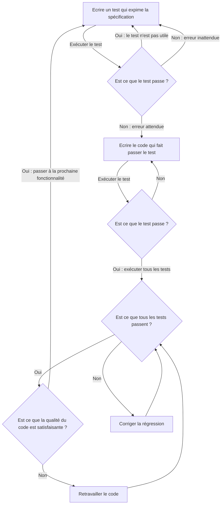

# Le développement dirigé par les tests

Le TDD est une méthode de conception et de développement dite "test-first" (les tests en premier). Au lieu d'écrire le code, puis, après d'en écrire les tests, on va entrelacer le fait d'écrire des tests et le code de production. On avance par petits pas au cours desquels on écrit d'abord un test, puis le code de production qui suffit à faire passer le test.

On peut résumer cela sous la forme d'un cycle à trois étapes RED-GREEN-REFACTOR :

- <format color="red">RED</format> : écrire un test qui ne passe pas (ne pas compiler compte comme ne pas passer)
- <format color="green">GREEN</format> : écrire le code de production minimal qui suffit à faire passer le test
- <format color="Blue">REFACTOR</format> : retravailler le code écrit pour en améliorer la conception et la propreté

Les objectifs du TDD sont :

- Du code propre, qui marche, écrit en un temps prédictible
- Une spécification exécutable : les tests sont vraiment exhaustif et font des vérifications pertinentes

Le processus de développement est le suivant :

Les avantages du TDD :

- **Vitesse** : permet de valider plus vite les idées, passer moins de temps à débugger et à tester manuellement. Les bugs sont aussi attrapés plus vite.
- **Confiance** : Les tests sont plus fiables et pertinents, ils sont une vraie spécification exécutable. Aussi, on a une bonne sécurité contre la régression lorsqu'on change le code.
- **Qualité** : force la réflexion autour des interfaces, on détecte ainsi les problèmes de conception plus tôt. On est forcé à refactorer plus souvent, donc on produit du meilleur code

Le TDD permet aussi de faciliter le processus de résolution de problème. Résoudre des problèmes, c'est gérer la complexité, et déconstruire les problèmes en plus petits. Le TDD est itératif et incrémental, la stratégie "diviser pour mieux régner", est incluse dans le processus. Cela permet de réduire la charge cognitive à un instant T quand on développe.

Attention cependant, le TDD n'est pas une méthode magique. L'adopter requiert un effort pour en adopter l'état d'esprit. C'est une compétence qui requiert du temps et de la pratique pour être maîtrisée, ce qui fait que l'on est plus lent au début. 
