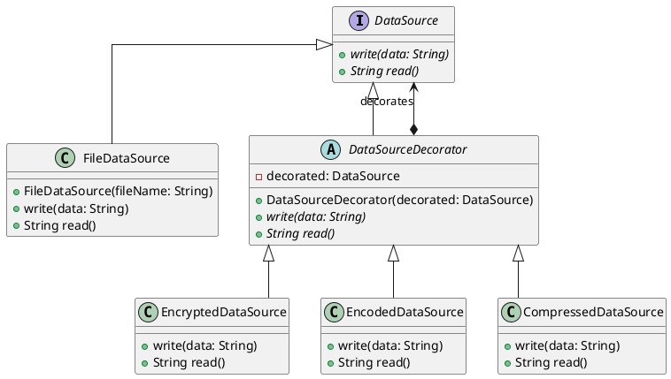
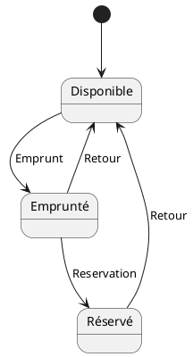
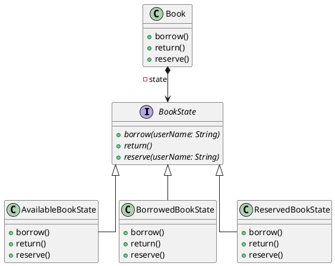

# Patrons de conception (Design Patterns)

Un patron de conception est une "recette" qui apporte une solution préfabriquée à un problème connu et récurant en ingénierie logicielle. Il en existe beaucoup, l'un des ouvrages de référence en la matière est [Design Patterns : Elements of Reusable Object-Oriented Software](https://en.wikipedia.org/wiki/Design_Patterns). Je vais présenter ceux qui sont (à mon sens et selon mon expérience) les plus intéressants à connaître.

## Pattern Décorateur (Decorator)

Le pattern décorateur permet de combiner des composants de façon transparente en utilisant la délégation. Il est utile quand on a besoin de pouvoir rajouter des comportements à un composant de manière dynamique sans casser le code appelant.

La structure du pattern est la suivante :

- Une interface : l'interface qui établit le contrat de service avec le code appelant.
- Le composant concret : l'implémentation "de base" de l'interface qui a le comportement par défaut.
- Le décorateur abstrait : une classe abstraite qui implémente l'interface et factorise le fait de déléguer le comportement par défaut à une instance de l'interface.
- Les décorateurs concrets : des classes implémentant le décorateur abstrait et enveloppant le comportement de l'instance qu'elle décore avec un nouveau comportement.

On peut prendre l'exemple d'un composant de source de donnée qui écrit et lit des données dans un système de stockage, avec la possibilité de chiffrer, encoder, ou de compresser les données.

La structure serait la suivante :



En implémentant ce pattern, on pourra avoir du code client comme ceci :

```Java
DataSource regularDataSource = new FileDateSource("myFile.txt")

DataSource encryptedDataSource = new EncryptedDataSource(
    new FileDateSource("encryptedFile.txt")
);

DataSource compressedDataSource = new CompressedDataSource(
    new FileDateSource("compressed.txt")
);

DataSource encryptedAndCompressedDatasource = new EncryptedDataSource(
    new CompressedDataSource(
        new FileDateSource("compressed.txt")
    )
); 
```

On peut donc combiner de façon transparente ces comportements simples, isolés ou combinés, derrière la simple interface `DataSource`.

## Pattern Fabrique (Factory)

Une fabrique est une classe à qui on va déléguer la création d'un objet. Cela peut être utile principalement dans deux situations différentes.

### Création d'objet complexe

La création d'un objet :

- Devient trop complexe
- Révèle trop au code appelant de la structure interne de l'objet
- Demande des responsabilités qui dépassent celle de l'objet

Dans ces cas-là, on utilise alors la fabrique pour décharger l'objet de la responsabilité de se construire, et on cache cette complexité au code appelant.

Par exemple, prenons le cas d'un objet qui est parsé depuis un format de sérialisation, par exemple, CSV.

```Java
public class Product {
  private String name;
  private BigDecimal price;
  
  public Product(String csvLine){
    final var productData = csvLine.split(",");
    this.name = csvLine[0];
    this.price = new BigDecimal(csvLine[1]);
  }
}
```

Ici, la création de l'objet contient la responsabilité de le déserialiser du format CSV, cela dépasse ses responsabilités, en effet le format de stockage est un concept très concret, très proche du détail technique qu'est le format de stockage. Puisqu'on est sur un objet qui modélise un produit, un concept beaucoup plus abstrait, on a un problème de niveaux d'abstraction mélangés, il faut donc distribuer la responsabilité.

```Java
public class Product {
  private String name;
  private BigDecimal price;
  
  public Product(String name, BigDecimal price){
    this.name = name;
    this.price = price;
  }
}

public class ProductFactory {

  public Product createProductFromCsvLine(String csvLine){
      final var var productData = csvLine.split(",");
      final var name = csvLine[0];
      final var price = new BigDecimal(csvLine[1]);
      
      return new Product(name, price);
    }
}
```

L'objet est ainsi déchargé de sa responsabilité gênante, mais la logique de déserialisation reste cachée pour le code appelant.

### Découplage de création d'objet

Situation : on a une interface, et des classes qui implémentent cette interface pour régler un problème par polymorphisme, et on veut déléguer la responsabilité de création.

Par exemple, nous avons cette classe qui évalue des expressions mathématiques, et qui a donc besoin de résoudre des opérations avec sa méthode `executeComputation` :

```Java
public class ReversePolishNotationCalculator {

    ...
    
    private void executeComputation(String token, Stack<Double> computeStack) {
        ...
        
        final var result = switch (token) {
            case "*" -> computeStack.pop() * computeStack.pop();
            case "/" -> computeStack.pop() / computeStack.pop();
            case "+" -> computeStack.pop() + computeStack.pop();
            case "-" -> computeStack.pop() - computeStack.pop();
            default -> throw new IllegalArgumentException();
        };

        ...
    }
    
    ...

}
```

On voudrait la refactorer en utilisant le polymorphisme pour sortir cette responsabilité, et donc pouvoir modifier et ajouter des opérateurs sans modifier cette classe. Je crée une interface pour cela, avec les classes qui vont avec :

```Java
public interface Operator {
    Double execute(Stack<Double> computeStack):
}

public class MultiplyOperator implement Operator {
    Double execute(Stack<Double> computeStack) {
         ... 
    }
}

public class DivideOperator implement Operator {
    Double execute(Stack<Double> computeStack) {
         ... 
    }
}

public class PlusOperator implement Operator {
    Double execute(Stack<Double> computeStack) {
         ... 
    }
}

public class MinusOperator implement Operator {
    Double execute(Stack<Double> computeStack) {
         ... 
    }
}
```

Maintenant, la fabrique va nous aider à abstraire la création des opérations de notre classe `ReversePolishNotationCalculator` :

```Java
public class OperatorFactory {
    public Operator buildOperator(String token) {
       return switch (token) {
            case "*" -> new MultiplyOperator();
            case "/" -> new DivideOperator();
            case "+" -> new PlusOperator();
            case "-" -> new MinusOperator();
            default -> throw new IllegalArgumentException();
        };
    }
}
```

Et on peut donc l'utiliser dans notre classe comme dépendance :

```Java
public class ReversePolishNotationCalculator {

    public final OperatorFactory operatorFactory;

    public ReversePolishNotationCalculator(OperatorFactory operatorFactory){
        this.operatorFactory = operatorFactory;
    }

    ...
    
    private void executeComputation(String token, Stack<Double> computeStack) {
        ...
        
        final var operator = operatorFactory.buildOperator(token);
        final var result = operator.execute(computeStack);

        ...
    }
    
    ...

}
```

Ainsi, grâce à notre factory, la résolution des opérations est abstraite de la `ReversePolishNotationCalculator`, on peut ajouter et modifier des opérateurs sans avoir à modifier la classe, on a distribué la responsabilité.


## Pattern Etat (State)

Le pattern Etat permet de modéliser de façon efficace une situation où un élément peut posséder différents états qui changent son comportement. Il repose sur la délégation et le polymorphisme pour éviter d'avoir une arborescence illisible de `if`.

Prenons l'exemple suivant : des livres dans une bibliothèque. Un livre dans une bibliothèque peut être **disponible**, c'est-à-dire sur les étagères de la bibliothèque, prêt à être emprunté. Ensuite si on l'emprunte, il devient **emprunté**, tant qu'il est emprunté, il ne peut pas être **emprunté** par quelqu'un d'autre, mais il peut être **réservé**, ce qui va notifier la personne qui le réserve lorsqu'il est retourné. Quand il est retourné, il redevient disponible.

Cela nous donne le diagramme d'état transition suivant :



La logique du pattern consiste donc à déléguer les actions relatives à l'état à des classes représentant chaque état :



Voici un exemple en Java :

```Java
public interface BookState {
    void borrow(String userName);
    void reserve(String userName);
    void giveBack();
}

public class Book {
    private BookState state;

    public Book() {
        state = new AvailableBookState(this);
    }

    public void setState(BookState state) {
        this.state = state;
    }

    public void borrow(String userName) {
        state.borrow(userName);
    }

    public void reserve(String userName) {
        state.reserve(userName);
    }

    public void giveBack() {
        state.giveBack();
    }
}

public class AvailableBookState implements BookState {

    private final Book book;

    public AvailableBookState(Book book) {
        this.book = book;
    }

    @Override
    public void borrow(String userName) {
        book.setState(new BorrowedBookState(book, userName));
    }

    @Override
    public void reserve(String userName) {
        throw new IllegalStateException("Can't reserve an available book");
    }

    @Override
    public void giveBack() {
        throw new IllegalStateException("Can't giveBack an available book");
    }
}


public class BorrowedBookState implements BookState {
    private final Book book;
    private final String borrowerUserName;

    public BorrowedBookState(Book book, String borrowerUserName) {
        this.book = book;
        this.borrowerUserName = borrowerUserName;
    }

    @Override
    public void borrow(String userName) {
        throw new IllegalStateException("Can't borrow an already borrowed book");
    }

    @Override
    public void reserve(String userName) {
        book.setState(new ReservedBookState(book, userName));
    }

    @Override
    public void giveBack() {
        book.setState(new AvailableBookState(book));
    }
}

public class ReservedBookState implements BookState {
    private final Book book;
    private final String reserverUserName;
    

    public ReservedBookState(Book book, String reserverUserName) {
        this.book = book;
        this.reserverUserName = reserverUserName;
    }

    @Override
    public void borrow(String userName) {
        throw new IllegalStateException("Can't borrow an already borrowed book");
    }

    @Override
    public void reserve(String userName) {
        throw new IllegalStateException("Can't reserve an already reserved book");
    }

    @Override
    public void giveBack() {
        book.setState(new AvailableBookState(book));
        notifyAvailability(reserverUserName);
    }
}
```

Ainsi, on a un code qui reflète bien les contraintes des règles métier du livre. Cela permet aussi un design plus maintenable et extensible, on peut facilement rajouter un état, modifier le comportement des états, sans impacter la classe livre.