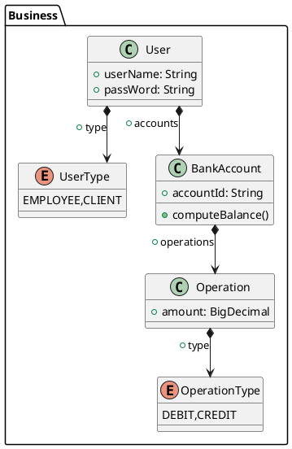
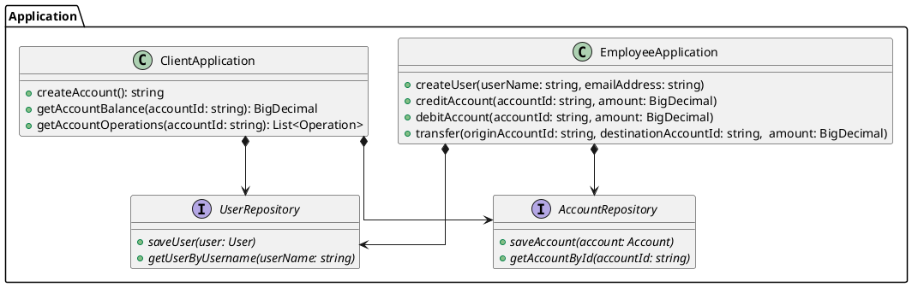

# Qualité d'architecture du code

## Architecture en couche

Pour structurer une application avec une architecture modulaire pour faciliter le développement et la maintenance, l'architecture en couche est très utile :

- La couche métier : les objets qui représentent les situations et règles métier
- La couche application : implémente les cas d'utilisation de l'application en utilisant les objets de la couche métier
- La couche d'interface : lien entre l'application et le monde extérieur (interface graphique, API Web...)
- La couche infrastructure : les outils techniques qui soutiennent les autres couches (frameworks)

L'idée est que la dépendance entre ces couches doit être de la plus concrète vers la plus abstraite : la couche interface dépend de la couche application, qui elle, dépend de la couche métier, la plus abstraite.

### Couche métier

Pour structurer le code de la couche métier, certains concepts sont intéressants :

- Entité : objet métier qui a une identité unique
- Objet-valeur : objet métier qui n'a pas d'identité unique
- Association : lien entre des objets métier
- Service : les processus qui ne sont pas de la responsabilité des objets
- Modules / paquets : segmentation logique des unités de code

### Couche application

La couche application implémente les cas d'utilisation de l'application, les points d'entrée métier de l'application. On peut la structurer en classes qui vont chacune regrouper une catégorie de cas d'utilisation. Elle implémente ces cas d'utilisation avec les objets de la couche métier, et définit des contrats de services dont la couche interface va dépendre.

### Couche interface

La couche interface fait le lien entre la couche application et la couche infrastructure, c'est le code qui va par exemple implémenter la logique de présentation d'une interface graphique, ou le contrôleur d'une API Web, mais aussi par exemple implémenter la persistence de données.

### Couche infrastructure

La couche infrastructure est la plupart du temps constitué de code qu'on ne va pas écrire dans le cadre de l'application, mais plutôt reposer sur des frameworks, libraries, et systèmes externes. On va y retrouver par exemple, le framework web, la libraire d'interface graphique, le driver de base de donnée.

## Exemple

Faisons un exemple d'analyse d'architecture pour l'application ayant les spécifications suivantes :

Un système de gestion de compte en banque qui a deux types d'utilisateur : les clients de la banque et les employés de la banque.

Le client peut :

- Ouvrir un compte en banque
- Consulter le solde d'un compte en banque
- Consulter la liste des opérations du compte en banque

L'employé peut :

- Créer un compte utilisateur
- Créditer un compte suite à un dépôt de liquide
- Débiter un compte suite à un retrait de liquide
- Effectuer un virement d'un compte à un autre

L'application doit être une API web qui sera consommée par des applications clientes sur le poste de l'employée et sur le smartphone du client.

En faisant l'analyse de cette spécification, on peut concevoir dans un premier temps l'architecture suivante.

### Analyse couche métier

On a :

- Entités : `User` et `BankAccount`
- Objet valeur : `Operation`
- Associations : Un `User` peut avoir plusieurs `BankAccount`. Un `BankAccount` peut avoir plusieurs `Operation`

### Analyse couche application

On fait une classe par catégorie de cas utilisation, et on établit deux types de contrat de service :

- Les méthodes publiques de nos classes correspondent chacune à un cas d'utilisation, et seront appelées par la couche interface.
- Les interfaces pour la persistance des données, ces interfaces seront implémentées par des classes de la couche interface

### Analyse couche interface

On aura ici deux types d'éléments :

- Des contrôleurs web qui vont exposer les méthodes de la couche application via une API web, et s'occupent de la sérialisation, de l'authentification des utilisateurs, des endpoints...
- Des repositories, des classes qui vont implémenter les interfaces de repository de la couche application pour sauvegarder les données de l'application dans un système de base de donnée en faisant des requêtes SQL

### Analyse couche infrastucture

Ici, on va retrouver les éléments ce sur quoi reposent les couches d'au-dessus :

- Le framework web pour l'API
- La bibliothèque d'accès base de donnée

Et un peu de code de l'application pour configurer ces composants.