# Débogueur

## Introduction

Le débogueur (*debugger* en anglais) est un outil fondamental du programmeur. C'est un programme qui permet d'exécuter un programme sur lequel on travaille tout en ayant la possibilité de faire les actions suivantes : 

- Mettre en pause l'exécution du code à un endroit précis, pour comprendre comment le code se comporte à un endroit précis.
- Avancer dans l'exécution du programme ligne de code par ligne de code, pour voir quelles branches de code sont empruntées dans certaines conditions.
- À tout instant, inspecter la valeur des variables, champs de classes, etc afin de comprendre comment le code interagit avec les données.

Tous les languages de programmation supportent le débogage. Tous les environments de development intégré supportent le débogage.

Quand on débute en programmation, pour trouver les erreurs dans notre code, on utilise les fonctions d'affichage de notre langage afin de voir l'état de nos variables à des moments précis. Le débogueur permet de trouver les soucis dans notre code de manière beaucoup plus puissante, flexible, et efficace.

## Déboguer du code Java dans IntelliJ IDEA

### Notion de point d'arrêt

Le concept fondamental du débogueur est la notion de **point d'arrêt** (*break point* en anglais). Un point d'arrêt est une ligne de notre code à laquelle on voudrait s'arrêter dans l'exécution pour scruter en détail l'exécution du code qui suit cette ligne.

## Définir un point d'arrêt

Pour définir un point d'arrêt, il faut faire un clic dans la marge de l'éditeur sur la ligne sur laquelle on voudrait arrêter l'exécution du programme : 

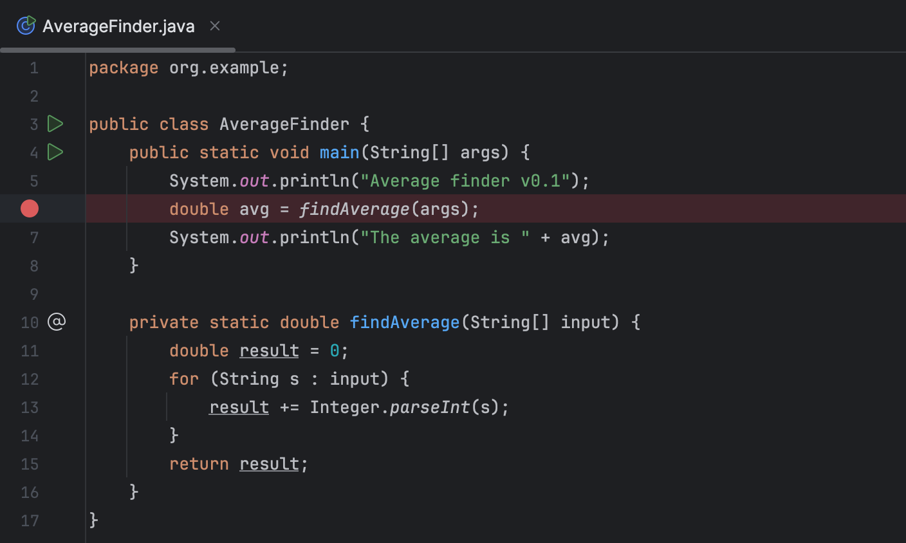

> On peut aussi définir des points d'arrêts conditionnels en faisant un clic droit et en définition une expression à partir des variables accessibles dans le contexte du point d'arrêts :
> 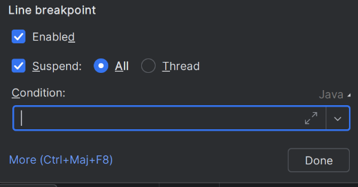
> 
> C'est très utile pour déboguer des boucles

### Démarrer la session de débogage

Dans IntelliJ, tout ce qu'on va faire exécuter par l'IDE, que ce soit par exemple notre application en passant par son point d'entrée (méthode main) ou via une tâche gradle, des classes ou méthodes de test, etc.

Toutes les configurations d'exécution dans IntelliJ peuvent être exécutées en mode débug, notamment le point d'entrée d'une application, ou une méthode de test unitaire.

On peut exécuter une configuration d'exécution en mode débug à chaque endroit où on peut le faire en mode normal. 

Que ce soit dans la marge de l'éditeur : 

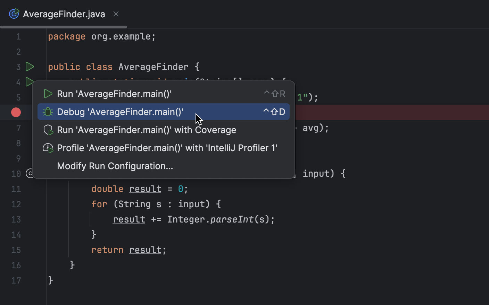

Ou dans le menu des configurations d'exécution en haut à droite de l'IDE : 

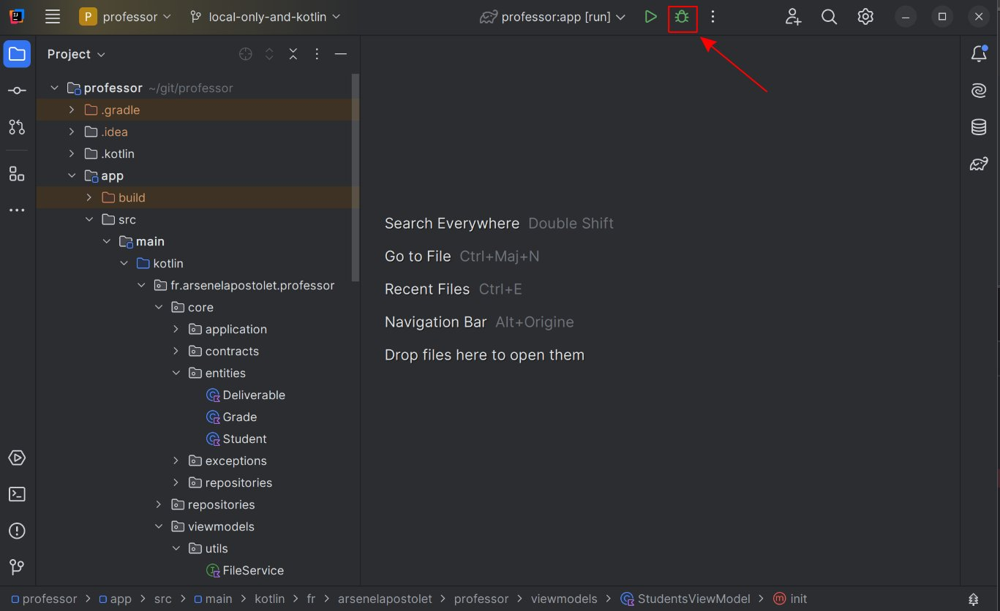

### Analyse du programme

Une fois le programme exécuté en mode débug, il va s'arrêter une fois le premier point d'arrêt atteint : 

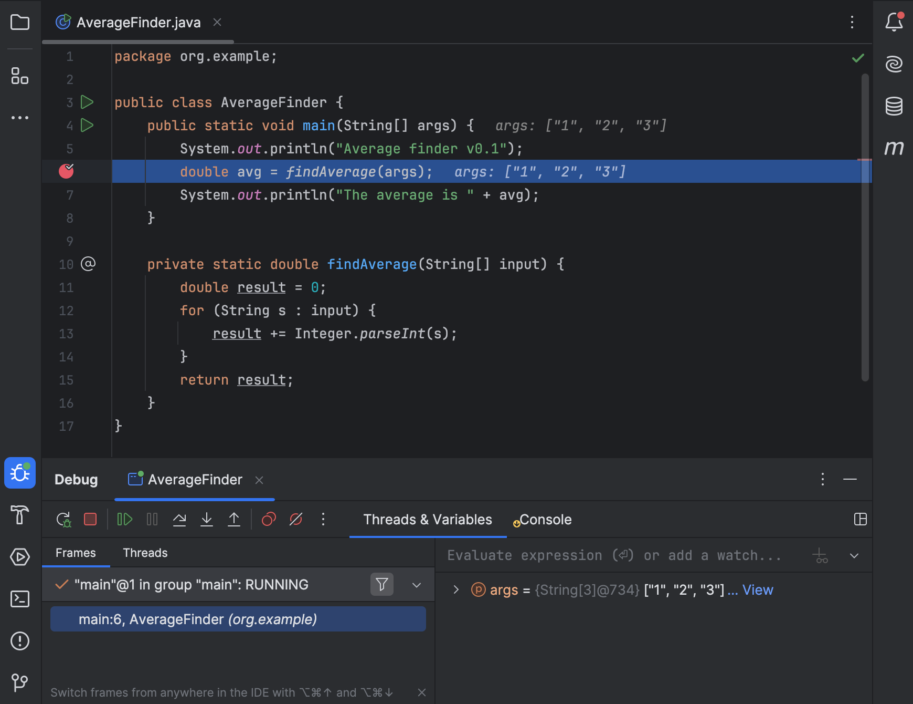

La ligne en surbrillance n'a pas encore été exécutée. Le programme attend vos instructions pour continuer. Vous avez plusieurs possibilités quand le programme est suspendu pendant une session de débogage : 

- Avoir des informations sur les variables dans le contexte de la ligne sur laquelle vous êtes arrêté : 
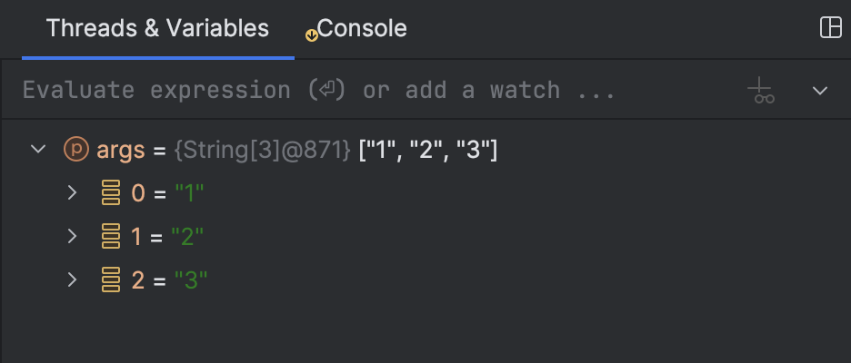 Cela vous permet de comprendre exactement ce qu'il se passe dans l'exécution de votre code et de comprendre comme il s'exécute, afin de trouver les erreurs.
- Avancer pas à pas dans le programme :
  - Rentrer dans une fonction sur la ligne courante (Step Into) : touche <shortcut>F7</shortcut>
    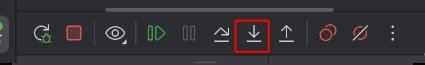
  - Avancer à la ligne suivante (Step Over) : touche <shortcut>F8</shortcut>
    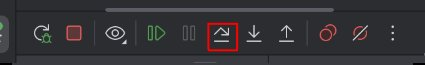
  - Reprendre l'exécution du programme jusqu'au prochain point d'arrêt (Resume) : touche <shortcut>F9</shortcut> 
    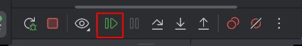
  - Redémarrer la session de débogage (Rerun) : touche <shortcut>Ctrl + F5</shortcut>
  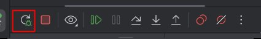
  - Redémarrer la session de débogage (Rerun) : touche <shortcut>Ctrl + F2</shortcut>
  - 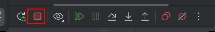 : Arrêter la session de débogage (stop)

## Références du cours

- [Document d'IntelliJ sur le débogueur](https://www.jetbrains.com/help/idea/debugging-your-first-java-application.html#examining-code)