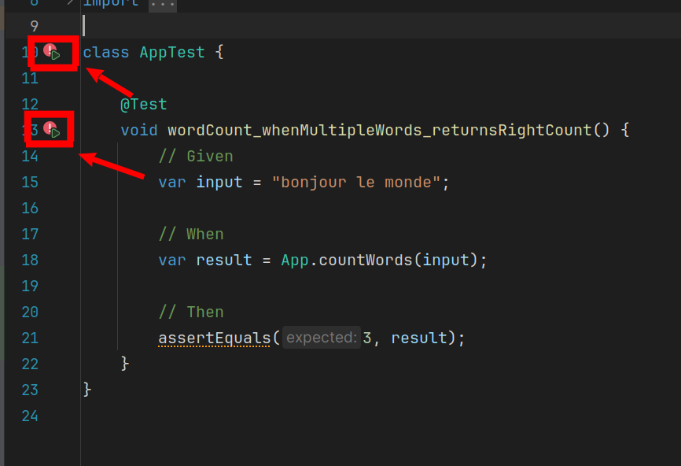
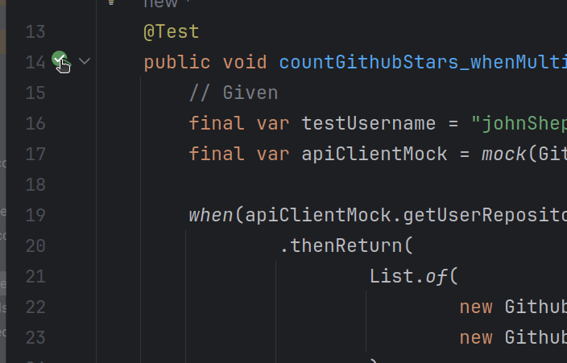
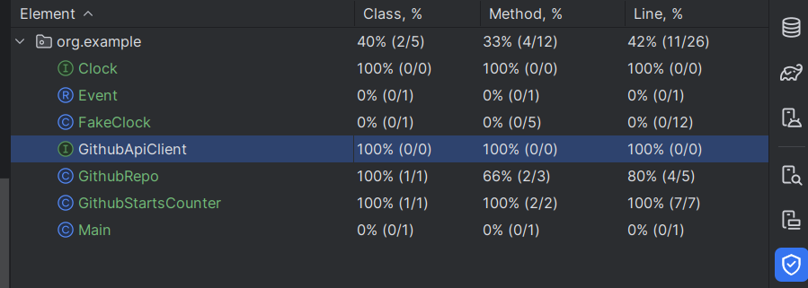
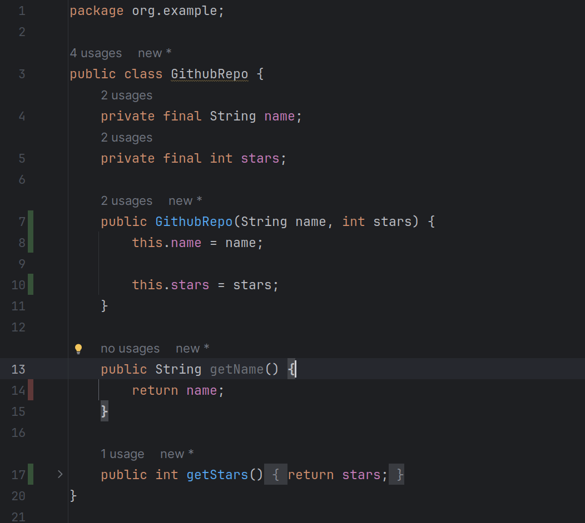

# Tests Unitaire et JUnit


## Les tests unitaires

Les tests unitaires sont les tests automatiques comportant le plus fin niveau de granularité, ils sont très proches des détails d'implémentation. Un test unitaire va tester une *Unité* de code spécifique. Une unité peut-être, une méthode, une classe, ou un petit groupe de classe ayant un fort lien logique.

L'objectif des tests unitaire est donc de vérifier de façon précise le comportement du code dans les différents cas d'usage possible.

Cependant, les tests ne peuvent pas être exhaustifs. Ils aident à trouver les bugs, mais ne permettent
pas d’affirmer qu’il n’y a pas de bugs.

Un test unitaire se découpe en trois étapes :

- Arrangement : mettre en place les conditions nécessaires à l'exécution du test
- Action : exécuter le code que l'on veut tester
- Affirmation : vérifier que le résultat est bien le bon

En suivant cette logique, les cas de test unitaire s'expriment sous une phrase telle que :

*Etant donné **\<arrangement\>**, quand **\<action\>**, alors **\<affirmation\>***

Example :

Pour tester une méthode `countWords(String input)`, dont l'objectif est de compter le nombre de mots dans une chaine, un cas de test classique sera :

***Etant donné** l'input "bonjour le monde" **quand** j'appelle `countWords`, **alors** sa valeur de retour devrait être 3*.

### Écrire des tests unitaires avec `junit-jupiter`

JUnit-Jupiter (ou JUnit 5) est la dernière version du framework de tests JUnit, le framework de tests unitaires de référence pour Java.

#### Classes de test

Avec JUnit, on structure les tests sous forme de suites (groupe des tests ayant un rapport) en utilisant des classes. Chaque classe de test est une suite de tests spécifique à une *Unité*. L'unité étant la plus petite entité de code ayant un sens à être testée, étant donné un contexte. Le plus souvent, c'est une classe, mais cela peut aussi être un petit groupe de classe fortement liées logiquement. Par convention, on appelle la classe de test avec le nom de la classe qu'elle teste, suivi de "Tests".

Par exemple, j'ai une classe `App`, ma classe de test pour cette classe sera `AppTest`. Aussi, la classe de test se trouve dans le même paquet que la classe qu'elle teste, mais du côté de l'arboresence de fichiers sous le dossier `test` de votre projet Java.

Par exemple, voici l'arborescence du dossier source de votre projet Java, avec une classe et sa classe de test, à leur place dans l'arborescence :

```
└── app
    ├── build.gradle 
    └── src
        ├── main
        │   └── java 
        │       └── demo
        │           └── App.java
        └── test
            └── java 
                └── demo
                    └── AppTest.java
```

#### Méthodes de test

Dans les classes de test, on a des méthodes de test. Chaque méthode correspond à un cas de test. Chaque méthode de test est annotée `@Test`. On peut avoir d'autre méthode utilitaires, qui ne sont pas des cas de test, et ne sont donc pas annotées.

Par exemple, dans la classe `App`, il existe une méthode `countWords` qu'il faut tester. Je peux donc créer le cas de test suivant dans `AppTests` :

```java
@Test
void wordCount_givenMultipleWords_thenReturnsRightCount(){

}
```

> En anglais :
> - *Given* signifie "étant donné"
> - *When* signifie "quand"
> - *Then* signifie "alors"

La méthode est nommée selon une convention qui reflète la phrase "EtantDonnée-Quand-Alors", ainsi le cas de test se lit comme une spécification.
Nous pouvons maintenant écrire notre test, en délimitant bien les trois étapes :

```java
@Test
void wordCount_whenMultipleWords_returnsRightCount(){
    // Given
    var input = "bonjour le monde";

    // When
    var result = App.countWords(input);

    // Then
    assertEquals(3, result);
}
```

`assertEquals` est une méthode d'assertion (ou vérification), qui permet de faire des vérifications sur le résultat, qui feront échouer le test si jamais la vérification échoue.

Vous pouvez exécuter le test en utilisant le petit bouton "Play" dans la marge de l'éditeur.



Cela créera directement une configuration d'exécution IntelliJ pour la méthode de test si on a cliqué sur l'income au niveau de la méthode de test, ou pour tous les tests de la classe si on a cliqué sur l'icône au niveau du nom de la classe.

### La couverture de test

La couverture de test, est un concept qui permet de voir quelle proportion du code de production est exécutée dans le cadre des tests.

Pour exécuter des tests avec la récupération des données de couverture, il faut exécuter les tests avec l'option "Run with coverage", symbolisée par le petit bouclier :



Une fois les tests passés avec ce mode, un outil s'ouvre sur le côté de l'IDE avec un récapitulatif de la proportion de code effectivement exécutée par les tests.



On peut également voir dans l'éditeur quand on ouvre un fichier, une légende dans la marge pour voir ligne par ligne quelles lignes ont été exécutées ou non par la dernière exécution de tests en mode couverture. La légende est verte si la ligne a été exécutée, rouge sinon. Cela peut être utile à regarder pour découvrir quels sont les aspects du code non encore couvert par nos tests, et aider à trouver quels sont les prochains tests à créer pour une couverture optimale.



La couverture de test est un indicateur intéressant de la qualité d'une suite de test, mais elle a ses limites. En effet, si une couverture de code très basse montre que beaucoup de code n'est pas testé, c'est à coup sûr que la suite de tests est insuffisante. Mais, une bonne couverture de tests ne signifie pas nécessairement que la suite de tests est de bonne qualité, car cet indicateur ne donne aucune information sur les vérifications qui sont effectuées par les tests, elles pourraient ne pas être pertinentes, voir complètement manquante. Ainsi, avoir une large couverture du code par les tests est donc une condition nécessaire, mais pas suffisante afin d'avoir une bonne suite de tests.

### Établir des cas de test

Pour établir des cas de test pertinent à postériori de l'écriture du code, il est important de se pencher sur les points "pivots" dans le code qui vont diviser les potentiels flux d'exécution de ce dernier. L'exemple le plus évident de point pivot sont les conditions (`if`,`switch`...) qui vont diviser le flux. Il convient donc de créer des cas de tests pour couvrir chaque côté des flux possible. Quand plusieurs conditions s'enchainent et se combinent, on peut voir les possibilités de flux exploser. On ne peut pas toutes les considérer, il faut alors se poser la question des cas qui ont le plus de sens d'un point de vue fonctionnel, et qui ont un impact sur le résultat global.

### Conception des tests et couplage

Pour avoir des tests de qualité, il faut faire attention de comment on conçoit nos tests, et donc à comment on découpe nos unités.

Le découpage en unité est important, car il permet de la facilité la compréhension en réduisant la largeur du contexte à comprendre à un instant T quand on lit le code. Il faut rassembler dans une unité des éléments qui ont un grand rapport fonctionnel ou technique entre eux.

Créer des tests à un endroit donné, c'est en quelque sorte "sanctuariser" une interface (ici interface au sens "interface publique d'une classe" ou contrat de la classe, c'est-à-dire les éléments d'une classe dont du code qui l'utilise peut dépendre), car désormais, les tests dépendent de cette interface, et donc, en cas de modification de l'interface, il faudra aussi modifier tous les tests associés, ce qui peut rendre un changement futur ou un refactoring plus douloureux. Il est normal de "sanctifier" ainsi certaines interfaces, mais il faut éviter d'avoir des tests trop contraignants, trop "serrés" par rapport au code, afin de ne pas rendre les changements futurs plus difficiles.