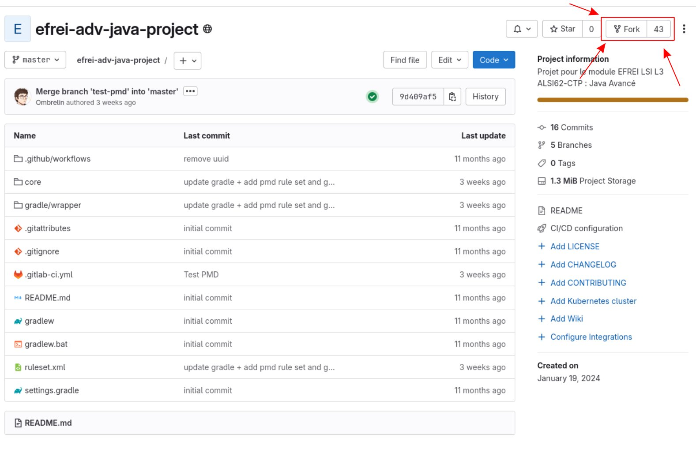
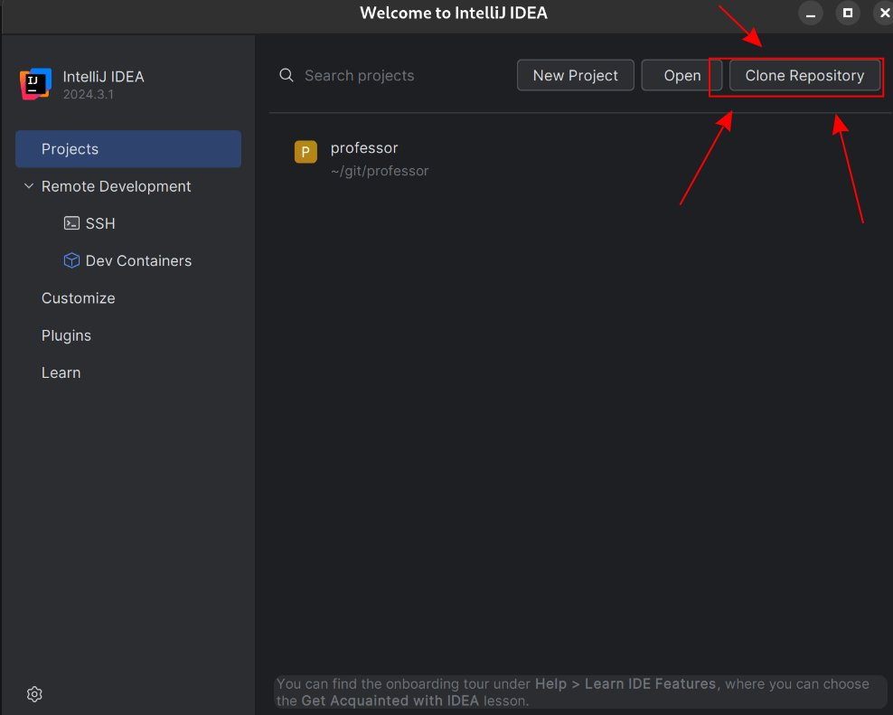
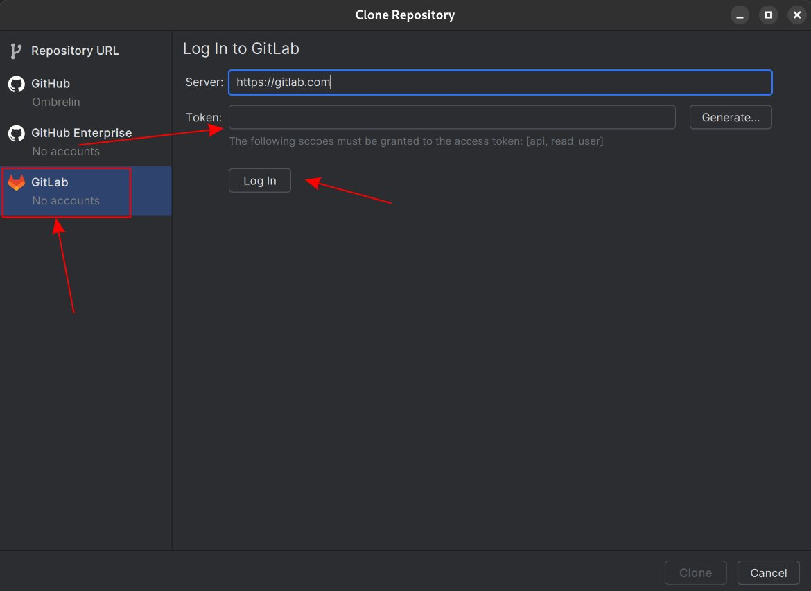
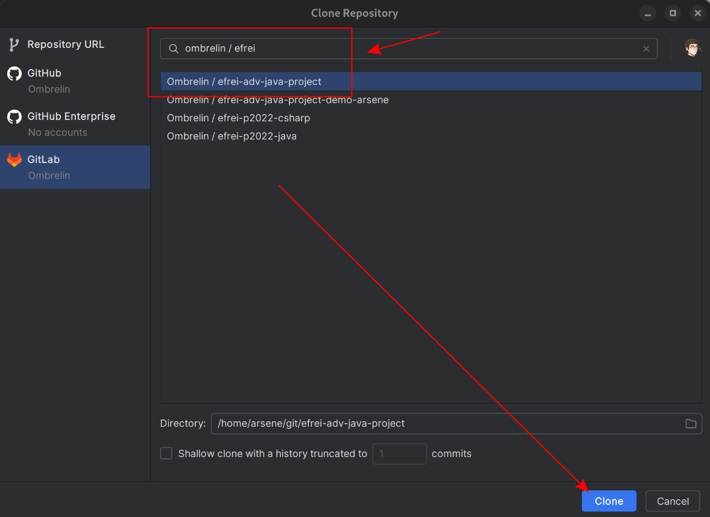
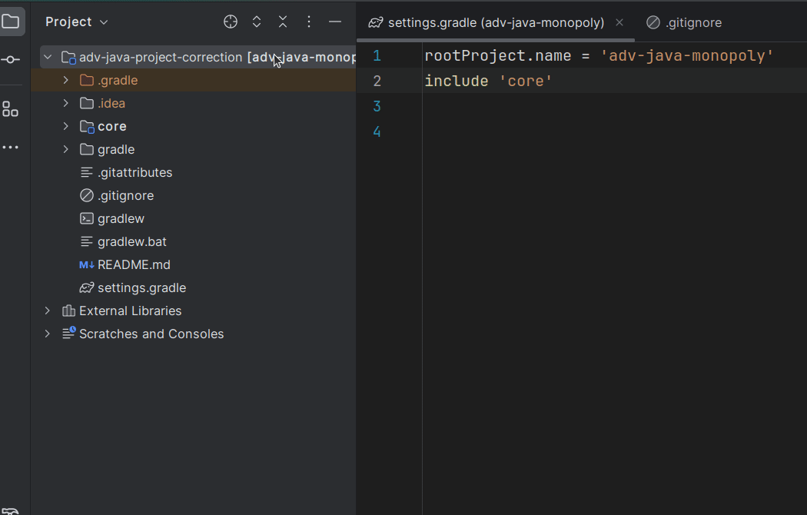

# Démarrage

## Compte GitLab

Le projet se déroulera sur GitLab, vous aurez donc besoin de créer un compte sur [Gitlab.com](https://gitlab.com).

## Binômes

Ce projet est à faire par binôme. Une fois que vous avez choisi votre binôme, renseignez le sur [ce document Excel](https://efrei365net-my.sharepoint.com/:x:/g/personal/arsene_lapostolet_intervenants_efrei_net/Ebe_SCA7SplGvBFiY2RYlY0BtYBns04gbDJKmka6ffWLhQ?e=qHzsV4), pour me communiquer votre binôme, votre nom d'utilisateur GitLab ainsi que celui de votre binôme.

## Forker le projet

Le projet est fourni sous forme de template dans [ce dépôt GitLab](https://gitlab.com/Ombrelin/efrei-adv-java-project), vous devez forker ce projet pour créer votre propre dépôt sur lequel vous allez travailler.



> N'oubliez pas de créer votre projet en privé !
{style="warning"}

## Ajouter le prof & votre binôme

Ajoutez-moi ensuite sur votre projet (mon nom d'utilisateur est `Ombrelin`) avec le rôle "Maintainer".

> N'oubliez pas d'ajouter également votre binôme ! (rôle "Maintainer" également)
{style="note"}


## Authentification sur Gitlab.com

L'authentification de votre environnement git local par rapport à Gitlab.com peut se faire par deux biais. Dans notre cas nous allons utiliser un jeton d'accès personnel (*personnal access token*), afin de faciliter l'intégration de git avec votre IDE IntelliJ.

### Création du token d'accès personnel (*personnal access token*)

<procedure>
<step>

Allez dans la [section "jeton d'accès" (*access token*) de votre compte sur gitlab.com](https://gitlab.com/-/user_settings/personal_access_tokens).

</step>
<step>
Ajoutez un nouveau token : 


> Cochez la case `api` pour la portée de votre jeton

</step>
<step>
    Une fois créé, conservez bien votre jeton (par exemple dans un gestionnaire de mots de passe. Une fois cette page quittée, vous ne pourrez plus le récupérer.
</step>
</procedure>

Une fois en possession de votre jeton, utilisez le à chaque fois que votre client git local, ou votre IDE vous demandera un mot de passe ou un jeton pour l'authentification git.

## Cloner le projet

<procedure>
<step>
    Ouvrez IntelliJ sur l'interface d'accueil et cliquez sur "Cloner un dépôt" (*Clone a repository*) :


</step>
<step>
    Ensuite, cliez sur l'option "Gitlab" sur la gauche de l'interface, renseignez votre jet dans le champs "Token", puis cliquez sur le bouton de connexion :


</step>
<step>
    Ensuite, la liste de vos dépôts présents sur votre compte gitlab s'affiche. Séléctionnez le dépôt qui correspond à notre projet, et cliquez sur le bouton "Cloner" :


</step>
<step>
IntelliJ va ensuite vous cloner et ouvrir comme un projet le dépôt.
</step>
</procedure>

## Description du dossier du projet

Le projet est un projet Gradle voir [la section du cours à ce sujet](Gradle.md). Il contient un module appelé `core` qui va contenir du code que je fournis :

1. Des tests d'intégration, qui vérifient de façon automatique que votre code implémente bien les spécifications requises.
2. Des abstractions (interfaces) qui permettent à mes tests de s'intégrer avec votre code

## Créer votre module

<procedure>

Avant de commencer, créer et positionnez-vous sur une nouvelle branche.

Pour commencer à travailler sur le projet il vous faut créer votre module, qui contiendra votre code de simulation :

<step>
Créer un nouveau module Gradle nommé `simulation` avec l'aide d'IntelliJ. En tant que "GroupId", saisissez `fr.&lt;votre nom&gt;&lt;nom binome&gt;.efrei.monopoly` :




</step>
<step>
Mettre à jour la configuration Gradle de votre module (le module `simulation`, vous ne devez jamais modifier le module `core` par vous-même) :

```Groovy
plugins {
    id 'java-library'
    id 'pmd'
}

pmd {
    ruleSetFiles = files("../ruleset.xml")
    ruleSets = []
    toolVersion = "7.5.0"
}

repositories {
    mavenCentral()
}

dependencies {
    implementation project(":core")
    testImplementation project(":core").sourceSets.test.output
    testImplementation platform('org.junit:junit-bom:5.9.2')
    testImplementation 'org.junit.jupiter:junit-jupiter'
    testImplementation "org.mockito:mockito-core:3.+"
    testImplementation 'org.assertj:assertj-core:3.24.2'
}

java {
    toolchain {
        languageVersion = JavaLanguageVersion.of(21)
    }
}


test {
    useJUnitPlatform()
}
```

> Similaire au module `core` mais avec la dépendance du module `simulation` vers le module `core` grâce aux lignes :
> ```Groovy
> implementation project(":core")
> testImplementation project(":core").sourceSets.test.output
> ```

</step>
<step>

Créer votre paquet racine dans votre projet. Suggestion de nommage (dans `main/java` et `test/java`) : `fr.<votre nom><nom binome>.efrei.monopoly.simulation`.

</step>
<step>

Créer un paquet `fr.<votre nom><nom binome>.efrei.monopoly.simulation.integration` dans votre  dossier de test (`simulation/src/test/java`), et créer une classe `MonopolyTests` qui étend ma classe de test `BaseMonopolyTests`. Ainsi, vous pourrez pour le 1er livrable implémenter la méthode `createMonopoly` pour fournir votre propre implémentation de `Monopoly` afin de pouvoir exécuter mes tests avec.

</step>
<p>
Vous avez terminé le setup pour le projet. Vous pouvez pousser votre branche pour que votre binôme puisse la récupérer de son côté.
</p>
</procedure>