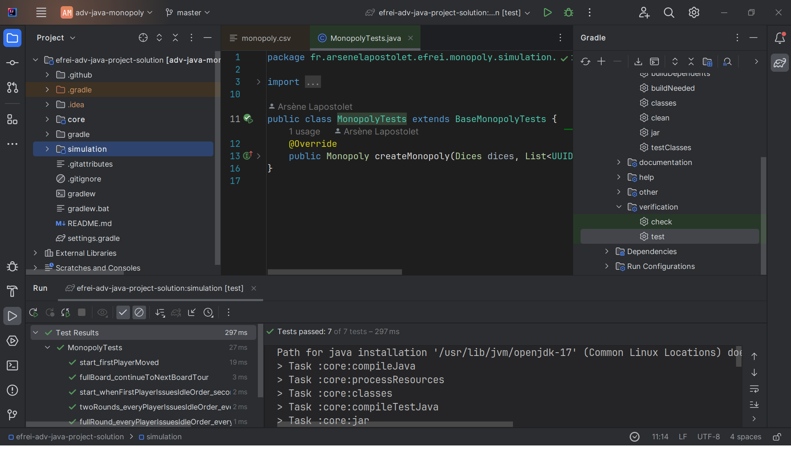
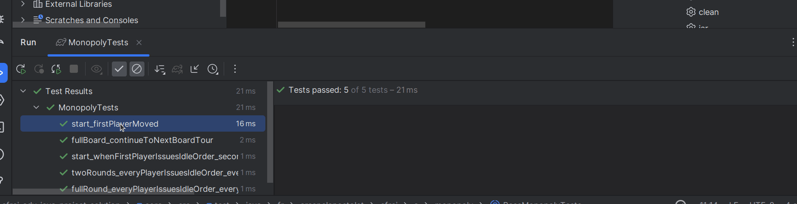
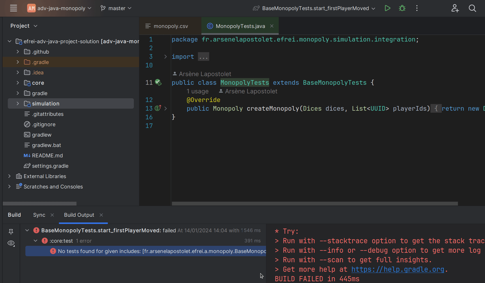
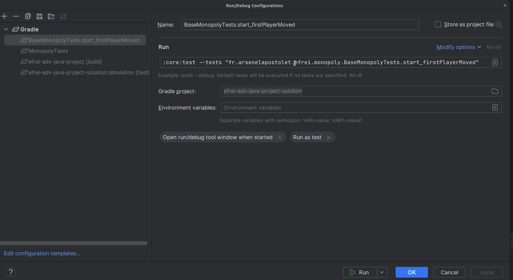
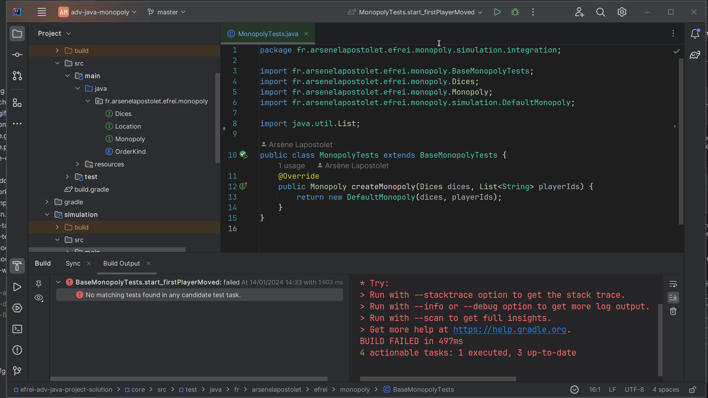

# Déroulement

## Processus de livraison

Pour un livrable donné *x* :

<procedure>
<step>
Sur votre dépôt, créer une nouvelle branche à partir de la branche master appelée *dev/livrable-x* en remplaçant *x* par le nom du livrable concerné.
</step>
<step>
Fusionner la branche *template/livrable-x* (où *x* est le numéro du livrable) de mon dépôt dans la branche*dev/livrable-x* en question de votre dépôt, afin d'avoir les tests d'intégration correspondant au livrable (vous pouvez le faire via l'interface de GitLab en utilisant une merge request que vous validerez vous-même).

</step>
<step>
Commiter sur cette branche les changements permettant de satisfaire les tests d'intégration du livrable
</step>
<step>
Créer une *merge request* de votre branche *dev/livrable-x*, vers votre branche *master*, en me mettant dans le champ *assignee* de la *merge request*.
</step>
<step>
Je vais ensuite être notifié de la demande de revue, et vais procéder à une relecture de votre code, et éventuellement faire des commentaires, des recommendations d'amélioration. Une fois ces améliorations implémentée ou votre choix spécifique argumenté, je ferai une évaluation du code en l'état, qui servira pour la partie "qualité" de la notation. Je vais enfin procéder à la fusion de votre branche de livraison sur votre *master*, vous pouvez ainsi reprendre le processus du début, pour le prochain livrable.

</step>
</procedure>

> Vous ne devez *jamais* commiter/pousser directement sur la branche *master* de votre dépôt.
> {style="warning"}

## Planning du projet

| Date                     | Sujet                                      |
|--------------------------|--------------------------------------------|
| Lundi 10 Février 2025    | Démarrage du projet                        |
| Dimanche 23 Février 2025 | Date limite de rendu du livrable 1         |
| Dimanche 23 Mars 2025    | Date limite de rendu du livrable 2         |
| Dimanche 5 Avril 2025    | Date limite de rendu du livrable 3         |
| Dimanche 20 Avril 2025   | Date limite de rendu du livrable 4         |
| Dimanche 4 Mai 2025      | Date limite de rendu du livrable 5         |

L'heure limite pour le rendu de chaque livrable est minuit. Cependant, j'organise la correction afin de vous avantager si vous travaillez de manière régulière et soumettez votre travail pour revue avant la date limite.

La correction de fait de la façon suivante : 

- Dès que vous avez fini le travail pour une version, vous pouvez le soumettre à revue en créant une *merge request* et en m'assignant dessus.
- Je vais si j'ai le temps, vous faire une revue, même si la date limite de rendu n'est pas encore passée, et je vous fais des commentaires pour améliorer votre code.
- Toute modification que vous ferez après ma première revue sera pris en compte lorsque je ferai la correction pour notation après la date limite de rendu.

> ***Ainsi, si vous rendez votre travail en avance, vous maximisez vos chances d'avoir une bonne note, car je vous fais une première correction sans vous noter, vous laissant la possibilité d'intégrer des modifications avant la notation.***
> {style="note"}

> En revanche, afin de pouvoir consacrer mon temps à tous de manière équitable, je ne fais qu'une seule "pré-correction" par binôme.

## Note sur l'exécution locale des tests d'intégration fournis dans le projet

La technique utilisée pour permettre de vous fournir des tests que vous pourrez brancher directement à votre code cause un petit souci avec le système d'intégration des tests Gradle d'IntelliJ. Heureusement, il y a une solution de contournement simple.

Le problème est le suivant : si vous exécutez vos tests d'intégration en passant par l'icône dans la marge de la classe et que vous exécutez tous les tests, ou bien que vous exécutez la commande `gradle test` tout va bien, les tests s'exécutent :

Cependant, si vous exécutez un test individuellement via la vue de test (par exemple parce que vous voulez débugger un test spécifique), une erreur apparait :

C'est parce que le système utilise le mauvais nom de classe et de module pour exécuter le test, il les prend de la classe de tests abstraite. Pour résoudre le problème :

<procedure>
<step>
Ouvrez la configuration d'exécution qui a été créée par l'essai que vous venez de faire :

</step>
<step>
Remplacez dans la commande du test :

- Le nom du module (`core` par `simulation`)
- Le nom (complet) de la classe `fr.arsenelapostolet.efrei.monopoly.BaseMonopolyTests` par le nom (complet) de votre classe : `fr.<votre nom><nom binome>.efrei.monopoly.simulation.integration.MonopolyTest`. Pour être sûr d'avoir le bon, vous pouvez le copier-coller de la commande de la config de la classe entière. Faîtes bien attention à laisser le nom de la méthode de test à la fin de la commande.

</step>
<step>
Le test devrait d'exécuter sans problème avec cette configuration, vous pouvez même la lancer en mode debug pour faire du pas à pas.

</step>
</procedure>

## Interface publique de la simulation

Le jeu est modélisé par une interface `Simulation` fourni, qui est utilisée dans les tests d'intégration fournis. Votre simulation doit implémenter cette interface.

L'élément central de l'interface est la méthode `submitOrder`, elle permet à un joueur d'effectuer une action, ou de passer son tour (ordre `IDLE`). Cette méthode résout aussi la situation avant l'action à faire par le joueur suivant.

En résumé `submitOrder` c'est :

1. Résolution de l'action du joueur
2. Jet de dé pour le déplacement du joueur suivant
3. Résolution du déplacement du joueur suivant et des conséquences de ce déplacement

D'autres méthodes sur l'interface permettent de lire les informations sur la situation courante du jeu.

## Intégration continue

Sur le projet, deux processus d'intégration continue vont s'exécuter quand vous pousserez un commit sur le dépôt :

- Analyse statique de code (`gradle check`) : qui vérifie via PMD que votre code est bien conforme aux règles que j'ai définies pour le projet.
- Tests (`gradle test`) : qui exécute tous les tests du projet, vos tests unitaires, mais aussi notamment mes tests d'intégration.

Pour qu'une *merge request* soit éligible à la revue par l'enseignant, ces deux processus doivent être en succès, ce qui est visible par des coches vertes en haut de la page de votre *merge request*.
